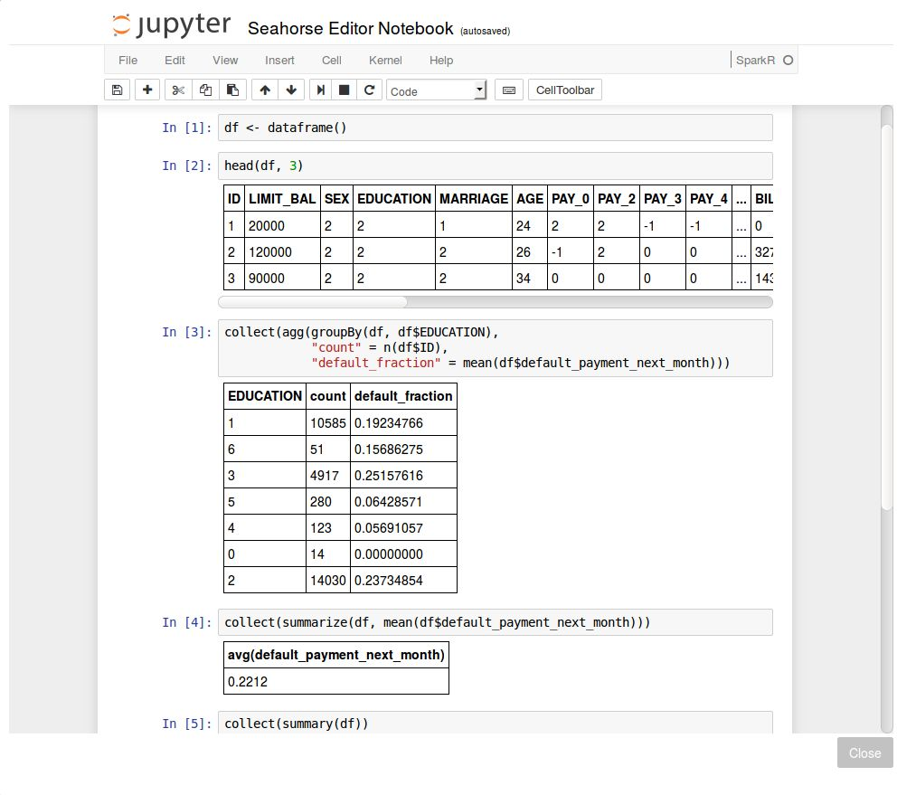
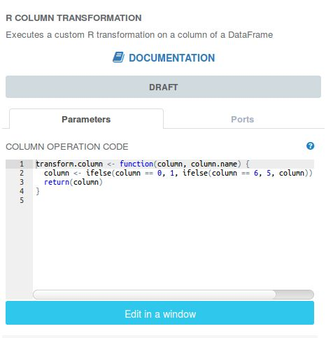
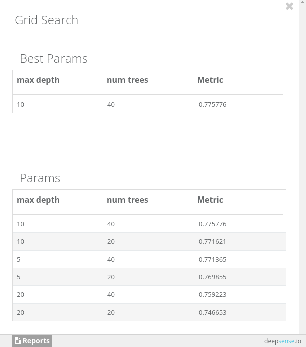

## Basic Information

**Dataset**: <a target="_blank" href="http://archive.ics.uci.edu/ml/datasets/default+of+credit+card+clients">Default of credit card clients Data Set</a>

**Dataset size**: 30,000 rows; 25 columns (11 integer colums, 14 numerical columns)

**Datasets description**: The dataset contains a description of customers of a bank along with information on their loan status.

**Business purpose**: Determining the probability of default among credit card clients

**Data set credits**: I-Cheng Yeh

Department of Information Management, Chung Hua University, Taiwan;
Department of Civil Engineering, Tamkang University, Taiwan.

UCI Machine Learning Repository <http://archive.ics.uci.edu/ml>. Irvine, CA: University of California, School of Information and Computer Science.

## Step-by-step Workflow Creation

### Reading Data

The data is provided in a form of a 25-column, comma-separated CSV-like file with column names in the first line.
To work with the dataset, it has to be loaded into Seahorse. This can be done by a
[Read DataFrame](../operations/read_dataframe.html) operation.
Let’s place it on the canvas using drag-and-drop from the operations palette.
To load the data, we need to provide the correct path to the file.

Just click on the Read DataFrame operation on the canvas. Now, in panel on the right click "Select data source".
Create "External file" data source and fill its "Source" parameter:

**SOURCE**: <a target="_blank" href="https://s3.amazonaws.com/workflowexecutor/examples/data/credit_defaults.csv">https://s3.amazonaws.com/workflowexecutor/examples/data/credit_defaults.csv</a>

Name it, e.g. "Credit card data", click "Ok" and select your newly created data source.
Having loaded the data, we proceed to its initial exploration.
To this end, let’s use the [R Notebook](../operations/r_notebook.html) block from Seahorse’s operations palette.

We open the Jupyter Notebook, and start exploring the data. With the use of the `dataframe()` function we are able to connect
to data on the Spark cluster and operate on it. We can invoke it like this:

df <- dataframe()


Some of the variables are categorical, for example, Education. In fact, reviewing the dataset documentation, we find that it is
an ordinal variable where 0 and 6 denote the lowest and the highest education levels, respectively. In the notebook, after printing
out the first three lines of data (the `head()` command), we performed an exemplary query for grouping the response variable with respect
to the education levels and compute fraction of defaults within groups. We observe some variability in default fraction with respect
to education. Moreover, some of the categories are rare. In total, across all customers, the default fraction is equal about 22%.

Note the use of `collect()` functions here. This is a Spark-specific operation - it invokes the computation of an appropriate command
and returns results to the driver node in a Spark application (in particular, it can be your desktop).

### Data Transformation

For later analysis we will drop the ID variable as it is irrelevant for prediction. We also see that there are relatively few occurrences
of extreme values of the Education variable: 0 and 6 which denote the lowest and highest education levels. Our decision is to decrease
the granularity of this variable and truncate its values to range [1, 5]. This can be achieved by a custom R Column Transformation as shown below.

Along with the Education variable, there are also other categorical variables in the dataset like marital status or payment statuses.
We will not employ any special preprocessing for them since the model that we plan to use - Random Forest model - is relatively insensitive
to encoding of categorical variables. Since most of the categories are ordinal, encoding them with consecutive integers is actually
a natural choice here. For some other methods, like the logistic regression model, we would need to handle categorical data in a special way,
for example, using [One Hot Encoder](../operations/one_hot_encoder.html).

### Model Training

At this point we are ready to train a model. Let’s use the introduced Random Forest classifier, an off-the-shelf trees ensemble machine learning model.
We devote 2/3 of data for tuning the model’s parameters - the number of trees in the forest and depth of a single tree - by
[Grid Search](../operations/grid_search.html) operation available on the palette. The other part of the data will be used for the final model
evaluation. Since the distribution of the target variable is slightly imbalanced toward “good” labels - about 78% customers in database paid
their dues - we will use [Area Under ROC](https://en.wikipedia.org/wiki/Receiver_operating_characteristic#Area_under_the_curve)
as the evaluation metric. This metric is applicable when one class (label) dominates the other.
It is more sensitive to retrieval of defaults in data [than accuracy score](https://www.quora.com/Why-is-it-that-I-get-a-better-accuracy-score-when-using-unbalanced-classes-with-a-Random-Forest-classifier)
(that is, the number of correctly classified instances regardless of their actual class).

For demonstration purposes, we varied the parameters of on a relatively small grid: 20, 40 for the number of trees in the forest
and 5, 10, 20 for a tree depth. The results of the grid search are presented below:

We see that the optimal values for the number of trees and a tree depth are 40 and 10, respectively. Since there is little difference
between choosing 20 or 40 as the number of trees, we will stick with the smaller forest consisting of 20 trees as our final model.

### Verifying Model Effectiveness On Test Data

Finally, we evaluate the model on the remaining 1/3 part of data. It achieves a score of 0.779738 AUC on this hold-out dataset.
This means that our model learned reasonably well to distinguish between default and non-default customers. For the sake of more interpretable results,
the confusion matrix may be helpful. In order to compute it, we will create another R notebook and attach it to the final data with computed predictions.

The confusion matrix is computed by retrieving two columns from the data frame and aggregating them. This is done again using the `collect()` function.
Here, it fetches two selected columns to the driver node. Such operations should be performed with care - the result needs to fit into
the driver node’s RAM. Here, we only retrieved two columns and there are merely 30K rows in dataset so the operation succeeds. For larger datasets,
we would order the computations to be performed by Spark. Finally, observe that we explicitly called the `table()` function from R’s base package
via `base::table()`. This is necessary since the R native function is [masked once SparkR is loaded](https://spark.apache.org/docs/1.6.0/sparkr.html#r-function-name-conflicts).

Let’s proceed to the analysis of the confusion matrix. For example, its bottom left entry denotes that in 377 cases the model
falsely predicted default while in fact there wasn’t one. Based on this matrix we may compute so-called precision and recall statistics.
Precision is the fraction of correct predictions (true positives) out of all predicted defaults by our model. Recall is defined as
the fraction of correctly predicted defaults divided by the total number of defaults in data. In our application, precision and recall
and are equal about 67% and 37%, respectively.

### Conclusion
We presented analysis of prediction of defaults of a bank’s customers. Throughout the way, we used SparkR for custom operations
and exploratory data analysis. We trained the model, optimized and evaluated it. Based on costs associated with customers’ defaults,
we can tweak precision and recall by, for example, adjusting the threshold level for probability of the default prediction and the
final label (no default vs default) produced by the model. We encourage you to try out your own ideas - the complete workflow is included in Seahorse.
