## Basic Information

**Dataset**: <a target="_blank" href="http://archive.ics.uci.edu/ml/datasets/Adult">Adult Data Set</a>

**Dataset size**: 32,561 rows; 15 columns (6 numerical columns, 9 string columns).

**Dataset description**: Dataset contains various information on US citizens such as:
age, workclass, education, marital status, sex, capital gain,
capital loss, hours per week, native country.

**Business purpose**: Predict whether a person's income exceeds $50K/yr based on census data.

**Data set credits**: Lichman, M. (2013). UCI Machine Learning Repository
<a target="_blank" href="http://archive.ics.uci.edu/ml">http://archive.ics.uci.edu/ml</a>.
Irvine, CA: University of California, School of Information and Computer Science.

## Workflow Overview

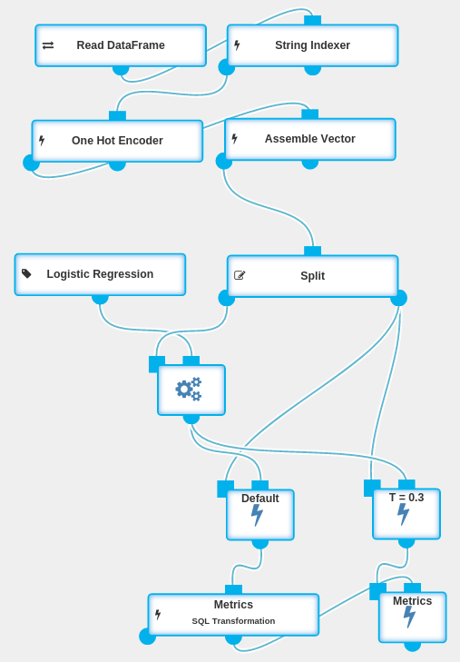

Many businesses would like to personalize their offer based on customer’s income.
High-income customers could be, for instance, exposed to premium products.
As a customer’s income is not always explicitly known, predictive model could estimate
income of a person based on other information.

Our goal is to create a predictive model that will be able to output a single decision - i.e. whether
the income of given person exceeds 50k per year - based on other information about the individual.

As our predictive method we will use logistic regression, which is a binary classification algorithm.
First, we will split our dataset into two parts - training set and validation set.
Then, we will train a logistic regression model on samples from the training set
and finally evaluate its accuracy based on validation dataset.

## Step-by-step Workflow Creation

### Reading Data

The data is provided in form of CSV file, with the names of columns described in the first row.
In order to pull the data we will use [Read Data Frame](../operations/read_dataframe.html) operation
with the following Data Source attached.

### Extracting Features and Transforming Data

Logistic regression algorithm expects each sample to be in a form of a vector of continuous features.
When we take a look at our dataset, we see that some of the columns are of numeric type,
while others are strings. In order to train our algorithm, we need to convert all of the string columns to numbers.

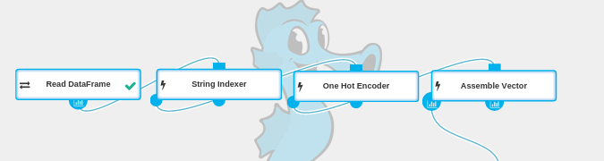

#### Mapping Strings to Numerical Values

First we need to map categorical values to numbers. To achieve this, we are using the [String Indexer](../operations/string_indexer.html) operation.
Conveniently, in our case we can select our columns by type.

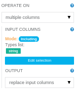

After executing this operation, we can see that for example in **sex** column all `Male` values were changed to `0`, while all `Female` values were changed to `1`.

#### Converting Numbers to Vectors

Although all of our features are now numeric, passing them directly to our algorithm would be a mistake.
This is because logistic regression could come up with erroneous conclusions while depending on their numerical properties.

This issue can be solved using [One Hot Encoder](../operations/one_hot_encoder.html) operation.
It receives a categorical value as a number from a fixed range, and produces a vector in which each column corresponds to one possible value of the feature.
For instance, **race** column has five possible values. One Hot Encoder will encode the second category as `[0,1,0,0,0]` and the fourth category as `[0,0,0,1,0]`.

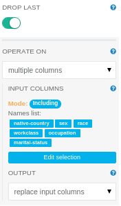

#### Assembling a Feature Vector

We use [Assemble Vector](../operations/assemble_vector.html) operation to group all relevant columns together
and form a column with a single vector of all the features.

In our case **is-over** column represents the prediction target. All the other columns are features.
We can easily select the desired columns using `excluding mode` selection to select everything
but the prediction target column.

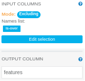

### Training Model

First we will split the data into a training set and a validation set.
Then we will use [Fit](../operations/fit.html) and [Logistic Regression](../operations/logistic_regression.html) operations to train the model.

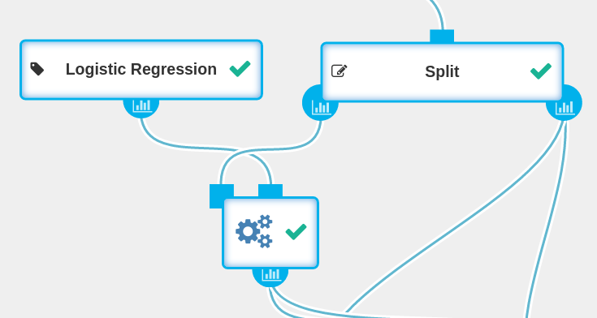

In this step, we're using the [Split](../operations/split.html) operation to split the data into a training set and a validation set.
Training set's purpose is to train the model. Validation set will later be used to evaluate the model's accuracy.
We will use a `0.7` `split ratio`, so that 70% of the data is used for training.

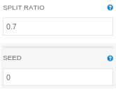

To train the model, we will need [Logistic Regression](../operations/logistic_regression.html) and [Fit](../operations/fit.html) operations.
Note that inside Fit operation's parameters, we need to change `label column` parameter to `is-over`.
We leave feature column parameter at its current value (`features`), because this is how we named the vector in Vector Assembler.
We will leave the default values in all of the remaining parameters as well.

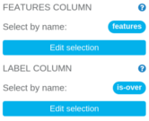

### Verifying Model Effectiveness

Now that we have our model trained, we can use it to predict the income for our hold-out validation set.
In order to do so, we'll add a [Transform](../operations/transform.html) operation.
We'll connect the validation set to the first port, and the model to the second one.
This will produce a dataset with predictions.

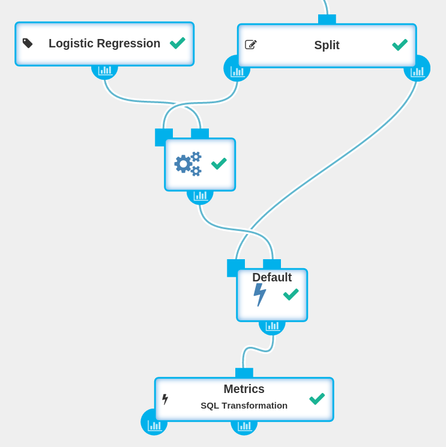

To evaluate the model, we will use the [SQL Transformation](../operations/sql_transformation.html)
operation to check for each prediction whether it is correct, and whether it is a *true positive*, *false positive*, *true negative* or *false negative*.

    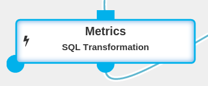
    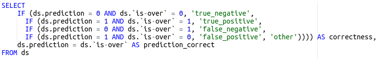

Let’s see the metrics for our model with the default transform parameters.
To do this, we need to open the report created for the resulting DataFrame.
We'll click on the distribution icon for the **correctness** column.
As we see on the distribution chart, the predictions of our model are correct for 86% of observations.

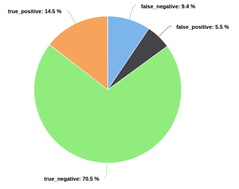

A *false negative* is a high-income customer classified as a low-income one.
Analogically, a *false positive* is a low-income customer classified as a high-income one.

Depending on application, it may turn out that *false negative* is a more severe type of an error than *false positive*,
as we might miss some business opportunities with high-income customers.
We might want to sacrifice some model accuracy for low-income customers in order to increase accuracy for high-income customers.

Internally, logistic regression predicts the probability that the income of a particular person exceeds $50k.
Then it makes the final decision based on the threshold parameter:
if the predicted probability exceeded the threshold, the decision is *>50k*, and in the other case: *<=50k*.

We may take advantage of this fact in order to decrease number of the *false negative* errors.
By decreasing the threshold, our model is more likely to classify a customer as a high-income one. It means that we will classify
more low-income customers incorrectly, but in the same time we will be much less prone to miss a high-income customer.

The threshold parameter can be changed in the Transform operation.
Let’s try to apply our model with a `0.3` threshold.
We can reapply our model and make predictions once again, on our validation set, but with the `threshold` parameter’s value changed to `0.3`.

Next, we want to use the same SQL Transformation, but on a different DataFrame.
SQL Transformation operation outputs a `SQLTransformer` that can be reused using a Transform operation.
For details about Transformers please refer to the [documentation](../classes/transformer.html).

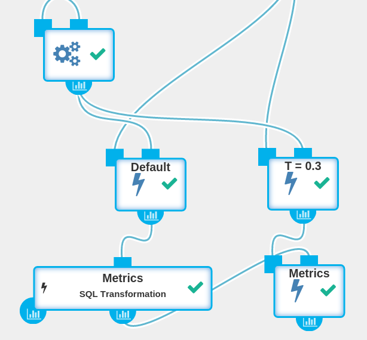

Let’s take a look at the effectiveness of our model with the modified threshold:

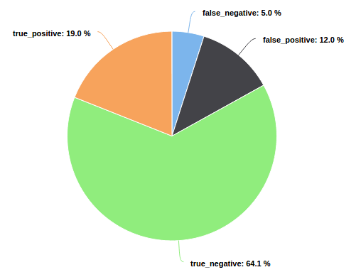

As we can see, our high-earner identification accuracy is much better now.
We got 19% *true* and 5% *false* predictions for high-income customers as opposed to previous 15% *true* and 9% *false*.
Although overall accuracy went down from 86% to 83%, our high-income client predictions accuracy went up considerably.

## Conclusion

In this case-study we constructed a model that is able to accurately predict whether an individual earns over $50k/yr
based on various data like marital status, education, age or nationality.
The model might be tuned to meet our business needs which could be to classify high-income customers more accurately.
