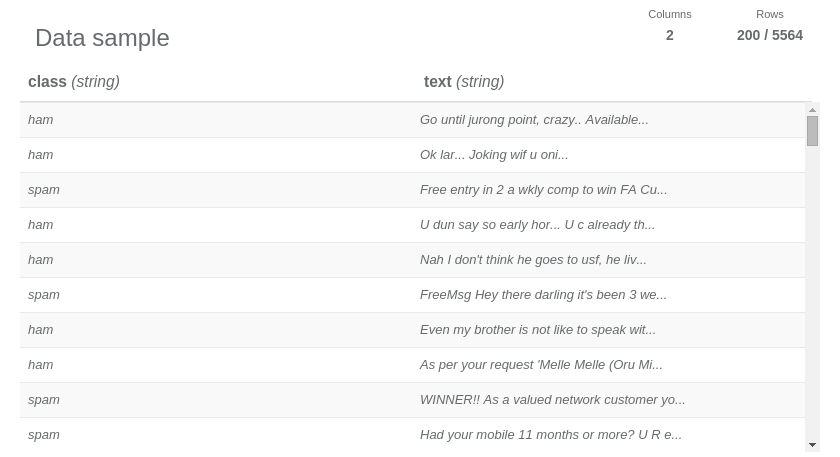
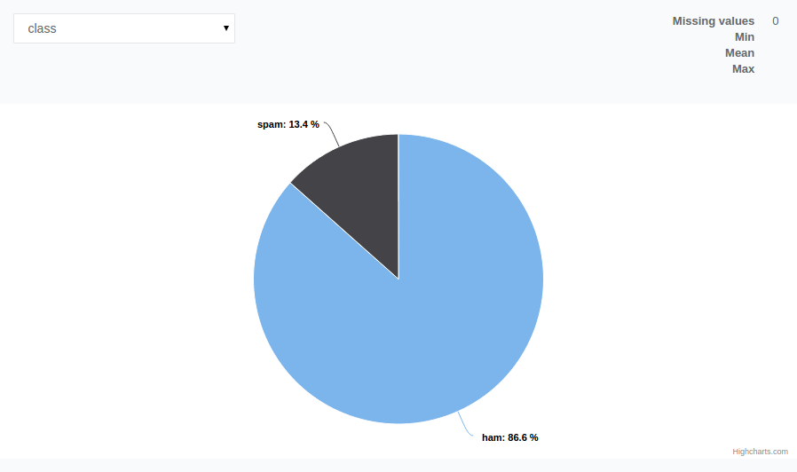
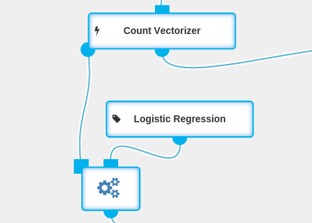
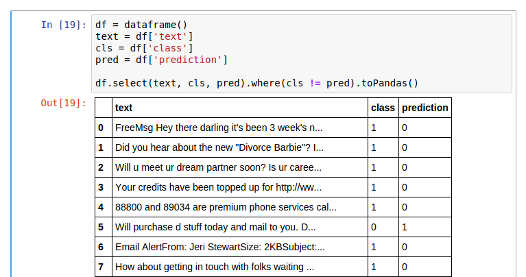
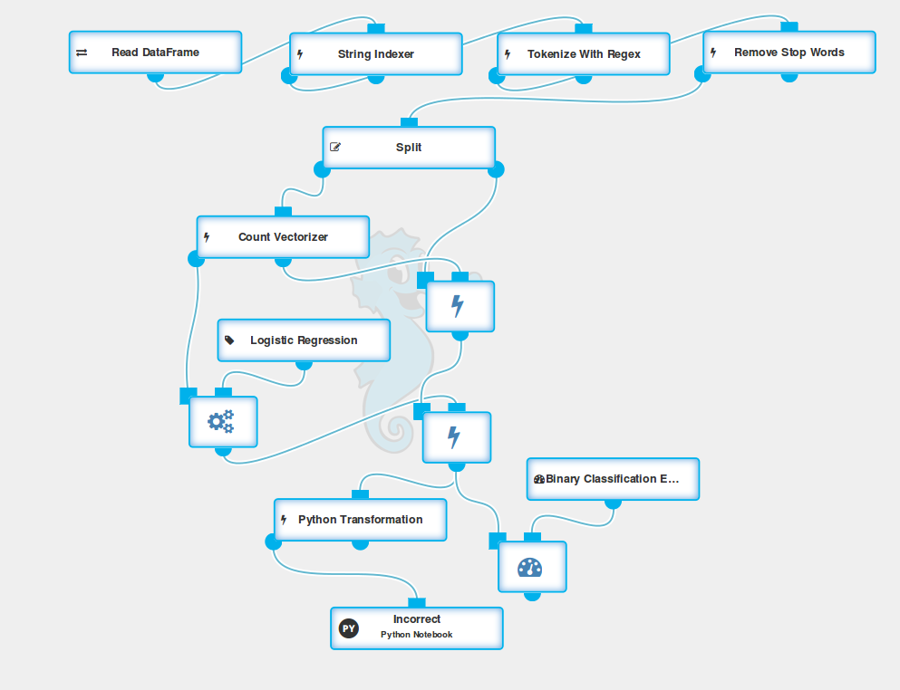

## Basic Information

**Dataset**: <a target="_blank" href="http://archive.ics.uci.edu/ml/datasets/SMS+Spam+Collection">SMS Spam Collection Data Set</a>.

**Dataset size and schema**: 5,574 rows, 2 string columns.

**Dataset description**: A single file containing short texts along with correct binary
categorization (spam or ham). Strongly biased toward the ham class (~87%).

**Business purpose**: Reducing the amount of text message spam in cellular networks.

**Dataset credits**: Lichman, M. (2013). UCI Machine Learning Repository
<http://archive.ics.uci.edu/ml>. Irvine, CA: University of California, School of Information and
Computer Science.

## Step-by-step Workflow Creation

### Reading the Data

The data is provided in a form of 2-column, tab-separated CSV file. For convenience, at the top of
the file we add a row with names of the columns: **class** and **text** separated with a Tab. Using
the [Read Data Frame](../operations/read_dataframe.html) operation  and Data Source with `CSV` format and
`Tab` selected as a `column separator`, we are able to pull the data into Seahorse. Let’s take a
look at the sample by clicking the report icon that appeared after running this single-node workflow.

We can see the distribution of the class column by clicking on a graph icon in its header. This tells us that there
are more “good” messages than spam, which in turn leads to the conclusion that the trivial
classifier that always returns “not spam” can serve as our baseline to which we can later compare
our model.

Now we need to do some preprocessing before this data is usable in any classifier.

### Data Preprocessing

We will use a [String Indexer](../operations/string_indexer.html) and
a [Tokenize with Regex](../operations/tokenize_with_regex.html) operations to transform
the data into a more usable form. The String Indexer will replace words `ham` and `spam` with `0`
and `1` values, and the Tokenize with Regex will allow us to transform the messages into  separate
words. We will use the `[a-zA-Z]+` regex pattern for the Tokenizer. We also set the `gaps` parameter
to `false` to indicate that the pattern describes the actual tokens, and not the gaps between them.
Afterwards, we use a [Remove Stop Words](../operations/remove_stop_words.html) operation
in order to filter out the most common stop words.

The preprocessing part of our workflow looks like this:

### Training and Test Datasets

The next step is to [Split](../operations/split.html) our data into two parts - the data
that we’ll use to train our model and the data on which our model will be tested. We use a `0.7`
`split ratio` which means, that 70% of the data will be used for training.

### Training the Model

The first thing to do here is to change the representation of the text column. Instead of an array
of words, we’d like a vector of <code>0</code> and <code>1</code>, where each column represents
whether a specific word appears in the corresponding message. That’s exactly what a
<a href="../operations/count_vectorizer.html">Count Vectorizer</a> is for: it creates a
dictionary of words from the entire dataset (each word is mapped to a number) and for each row it
creates a vector in which column N is set to <code>1</code> if the word N appears in the text
message. Aside from setting the name of the output column, let’s leave its parameters as they are by
default. In particular, <code>Min Different Documents</code> should be <code>1</code>. We are using
the Count Vectorizer operation after splitting the dataset in order to avoid test dataset knowledge
leaking into our model.

Now, we can do the actual training. We need to use a
<a href="../operations/fit.html">Fit</a> operation in order to train a
<a href="../operations/logistic_regression.html">Logistic Regression</a> classifier on our
data.

That’s it - coming out of the Fit is our trained model. We can apply it to the test part of the
dataset and find out how accurate it is.

### Testing and Evaluating the Model

Since we split our data only after some preprocessing, all we need to do, in order to test our
model, is to transform it with the transformer created by the Count Vectorizer operation and then
with the Logistic Regression model.

Afterwards, all that’s left to do is to evaluate our model.
This can be done either by manually implementing a simple accuracy metric with a
[Python Transformation](../operations/python_transformation.html),
or using available evaluation tools like a
[Binary Classification Evaluator](../operations/binary_classification_evaluator.html),
which provides two metrics: `Area under ROC` and `Area under PR`. However, we suggest using accuracy
here since it is an intuitive metric with simple interpretation: it just counts the number of
correctly classified messages.

A simple Python Transformation with the following code produces a human-readable table.

Further exploration of the resulting DataFrame with a
<a href="../operations/python_notebook.html">Python Notebook</a> yields the messages that were
incorrectly classified by our model. It’s a good starting point for the process of improving our
model.

And here is the entire workflow. The accuracy of the final model on the test dataset is above 97%,
which compared to the baseline (the naive model always returning “ham”) of 87% is a big improvement.

## Further Experiments

Now that we have the full workflow, we are free to experiment a bit with algorithms' parameters.
For example, we could change `Min Different Documents` in the Count Vectorizer to include only words
appearing in more than a single text message. Another idea is to tweak the regex in the Tokenize
with Regex - maybe it should simply be replaced with a Tokenize operation? Maybe we could change
the Logistic Regression parameters or even use a completely different classification algorithm?
