## Basic Information

**Dataset:** [US Baby Names](https://kaggle2.blob.core.windows.net/datasets/13/13/files/StateNames.csv.zip)

**Dataset size:** 5,647,426 rows; 6 columns.

**Dataset description:** Dataset contains data about names given to newborns. Baby names count is summarized by state and year. Due to privacy reasons, only names with at least 5 babies born in the same year & state are included in this dataset.

**Business purpose:** Exploration of names’ popularity through data visualization.

**Dataset credits:** <a target="_blank" href="https://www.kaggle.com/kaggle/us-baby-names">https://www.kaggle.com/kaggle/us-baby-names</a>.

Released Under CC0: <a target="_blank" href="https://creativecommons.org/publicdomain/zero/1.0/">Public Domain License</a>.

<a href="workflows/09_us_baby_names.json" download>Download workflow</a>

## Step-by-Step Workflow Creation

### Reading the Data

The first thing we need to do is load the data into Seahorse. This is done by placing a [Read DataFrame](../operations/read_dataframe.html) operation on the canvas and modifying its parameters:

**SOURCE**: [https://s3.amazonaws.com/workflowexecutor/examples/data/StateNames.csv](https://s3.amazonaws.com/workflowexecutor/examples/data/StateNames.csv)

Run the workflow by clicking the **RUN** button in the top panel. Depending on your internet connection speed, it will take up to few minutes to download the data. When the execution completes, we can see what  the data looks like. Display DataFrame’s report by clicking on the output port of the Read DataFrame operation.

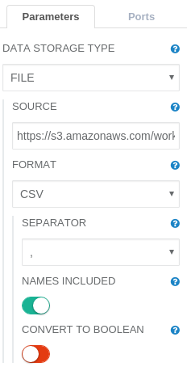

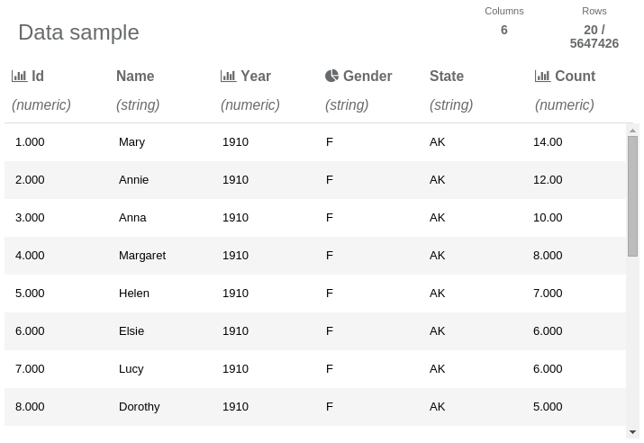
<em>The read data frame report. It contains a data sample of only 20 out of the 5,647,426 rows.</em>

By clicking on the icons in report header, you can see more information about the whole data set (not just the data sample). Click on the **Year** column icon to see its values’ distribution:

  

As we can see in the histogram, we have data for the years 1910 to 2014. Another interesting information is that we have a lot more data from recent years.

Now, let’s choose the **Gender** column in the report:

  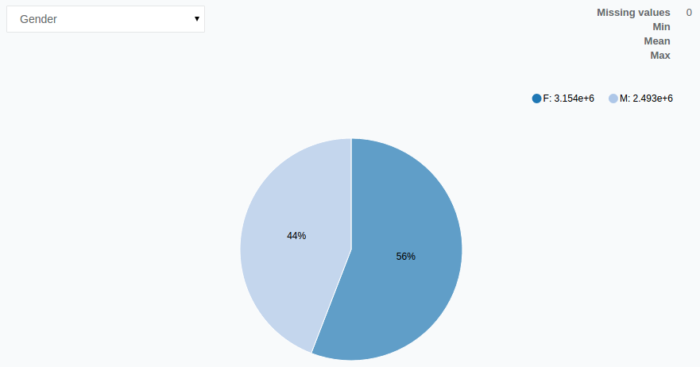

The pie chart for the **Gender** column illustrates that there is more data for females than males. Since this is official government data, we can assume that there are more female newborns than male, or that unusual names are more popular for males thus are not included in the dataset.

## Filtering the Data

Let’s take a closer look at the female names (an analysis of male names would be analogous; if you feel confident, you can explore male names while following this tutorial). We can use a [Filter Rows](../operations/filter_rows.html) operation to select only female names.

The [Filter Rows](../operations/filter_rows.html) operation is parameterized by an expression which will be used to select the desired rows. To select female names, we can use the expression below:

**CONDITION**: `Gender = 'F'`

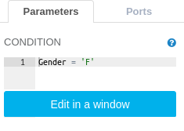

### Finding the Most Popular Names

The first question we will explore is:  what names were the most popular. We need to sum the **Count** column for every name, disregarding the year and the state in which the  child was born. To achieve this, we will use a [SQL Transformation](../operations/sql_transformation.html) operation. Let’s leave **dataframe id** set to `df` and just modify the **expression** parameter:

**EXPRESSION**:

select Name, sum(Count) as Count from df group by Name order by Count desc


  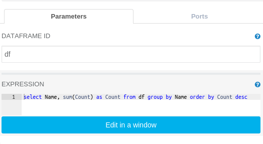

  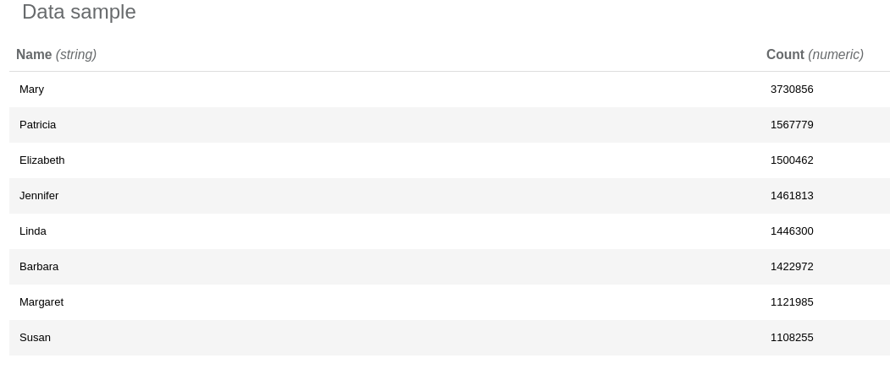

After running the operation we can explore its report and see that the three most popular names are Mary, Patricia and Elizabeth.

We have found the most popular names in the U.S., but we can also narrow our results down to find the most popular names in particular states.

#### Most Popular Names in States using Custom Transformer

To find the most popular names in a certain state we need to execute a sequence of operations. It is a good practice to enclose such a sequence within a “procedure” which can be reused later.

To do that we need to use a [Create Custom Transformer](../operations/create_custom_transformer.html) operation. Please drag and drop Create Custom Transformer to the canvas and click the **Edit workflow** button on the operation parameters panel. This takes us to a new canvas where we can create a custom [Transformer](../classes/transformer.html). A Transformer is a function which takes a DataFrame as an input and returns another DataFrame as the output. We want to create a Transformer that calculates the most popular names in a given state.

To do that, we need to:

1\. Calculate how many times each name was given in every state.

  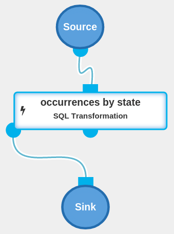

We can achieve this by executing a SQL Transformation operation:

**EXPRESSION**:

select df.Name, df.State, sum(df.Count) as AllTimeCount from df group by df.State, df.Name


2\. For every state, calculate number of occurrences for the most popular name in the state.

  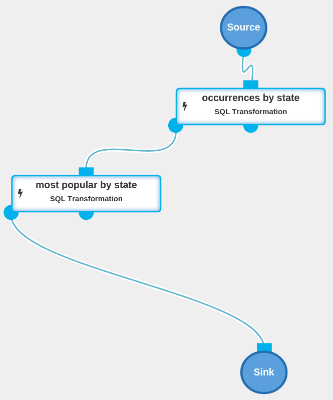

In order to do so we need to execute a SQL Transformation operation:

**EXPRESSION**:

select State, max(AllTimeCount) as MaxCount from df group by State


3\. Now, we will use a [Join](../operations/join.html) operation to filter out only the most popular names for each state. We will join name occurrences (from step 1) with counts of the most popular names in every state (step 2).

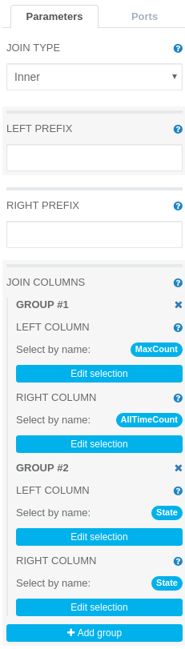

We need to add a Join operation to the canvas and set two equality constraints as the joining conditions: Left DataFrame’s column **MaxCount** should be equal to right DataFrame’s column **AllTimeCount**. Left DataFrame’s column **State** should be equal to right DataFrame’s column **State**. This can be done by setting two appropriate groups in the **join columns** parameter (see image below).

  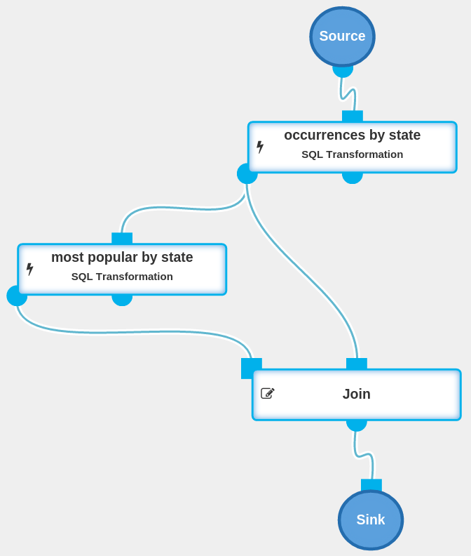

Close the inner workflow by clicking the **CLOSE INNER WORKFLOW** button at top of the screen.

Add a [Transform](../operations/transform.html) operation to the canvas and connect it with nodes, as shown below:

  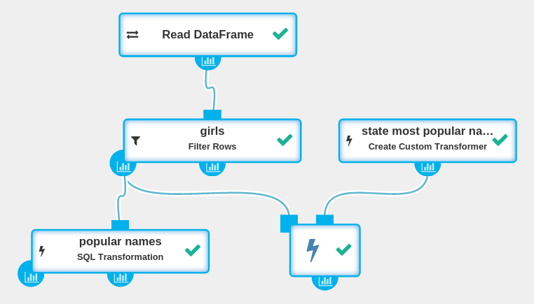

After we execute the current workflow and open the report for the Transform operation, we can see which names were the most popular in which state. By clicking on the **Name** column, we can see its distribution:

  

It turns out that Mary was the most popular name in Washington D.C. and 48 states with Jennifer topping the list in just two states.

### Traditional vs Modern Names

Some parents like traditional names while others prefer modern ones. We will now explore which names were popular in the past, and which names are popular now. To do that we split our data into two DataFrames:

1. Data from before January 1, 1980

2. Data since January 1, 1980

We can do such splits by executing two SQL Transformations.

SQL Transformation (select traditional names):

**EXPRESSION**:

select * from df where Year < 1980


SQL Transformation (select modern names):

**EXPRESSION**:

select * from df where Year >= 1980


  

Now let’s find out what were the most popular names before and after 1980. We do not need to write another SQL Expression, as we already created a Transformer that does it for us. All we need to do is apply the Transformer to different DataFrames. The SQL Transformation operation, besides returning a DataFrame, also returns a SqlTransformer which can be executed using a Transform operation.

We can also use the previously defined Create Custom Transformer to calculate popular names in each state and just apply it to another DataFrame.

  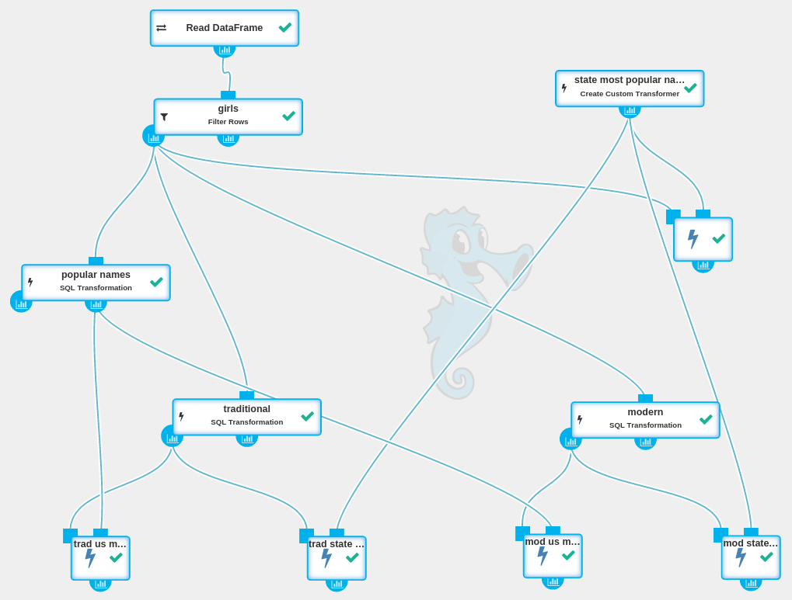

The execution of the current workflow might take a few minutes. By viewing reports from the lowest operations, we can see that the most popular names before 1980 were Mary, Patricia and Linda. Mary was the most popular name in every state and in Washington D.C. The most popular names since 1980 are Jessica, Ashley and Jennifer.

Now, let’s take a closer look at the report for the most popular modern names:

When we click on the **Name** column in the report for the most popular modern names in states we see:

  

We can see that Jessica was the most popular name in 31 states, Ashley in Washington D.C. and 16 states, with Emily leading the way in two states and Sarah in one (New Hampshire).

### Name Popularity Plot - Data Visualization

As we discovered, the most popular names were:

* all time: Mary, Patricia, Elizabeth;

* before 1980: Mary, Patricia, Linda;

* after 1980: Jessica, Ashley, Jennifer.

Let’s filter only the data regarding these names and then take a closer look.

As a first step, we have to filter the data using a SQL Transformation operation with an appropriate expression:

**EXPRESSION**:

select Name, Year, sum(Count) as Count
from df
where
    Name = 'Mary'
    or Name = 'Patricia'
    or Name = 'Elizabeth'
    or Name = 'Linda'
    or Name = 'Jessica'
    or Name = 'Ashley'
    or Name = 'Jennifer'
group by Name, Year
order by Year


Now, let’s connect a Python Notebook operation to the newly created and filtered DataFrame:

  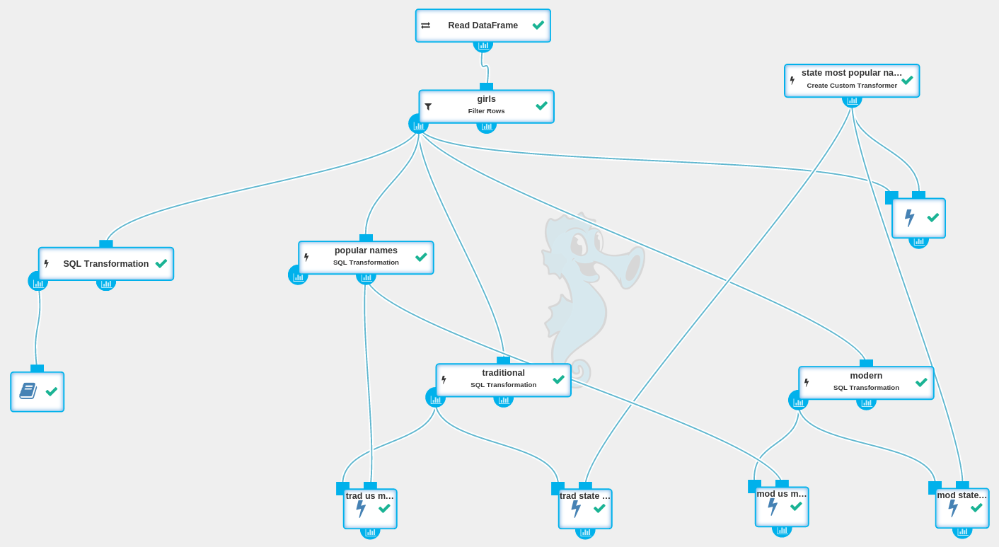

Python Notebook gives us the ability to interactively explore the data. We will use it to draw a plot of the names’ popularity. To do so, we need to execute the following Python code in the notebook:


import matplotlib
%matplotlib inline

df = dataframe().toPandas()
# Reshape data (produce a “pivot” table) based on column values
names_over_year = df.pivot("Year", "Name", "Count")
names_over_year.plot()          # Make plot of DataFrame using matplotlib
fig = matplotlib.pyplot.gcf()   # Get a reference to the current figure
fig.set_size_inches(18.5, 10.5) # Set the figure size



The code above prepares the data and draws a plot of the names’ popularity. After executing it, a plot will be displayed:

  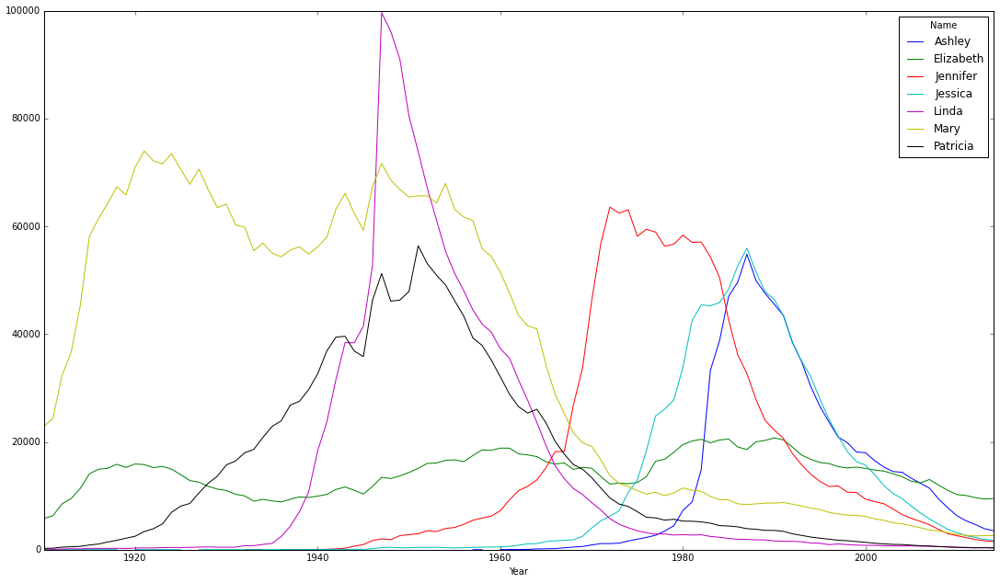

The graph shows that Mary was a very popular name until around 1960, when its popularity dropped. Meanwhile the popularity of Elizabeth has been the most stable throughout the time-frame.

The popularity of the name Linda is an interesting example as it  became hugely popular during the 1950s and then rapidly dropped back to its previous low levels. Linda may owe its brief popularity to Buddy Clark’s 1946 hit song <a target="_blank" href="https://www.youtube.com/watch?v=Ynyn3UQPlWU">“Linda”</a>.

## Conclusion

We have briefly explored U.S. Government’s statistical dataset. It transpires that names’ popularity may be influenced by many factors. For example, we have found that the most popular name in the last century was Mary, which may owe its popularity to Christian culture, but it has lost in popularity since the 1960s when counterculture revolution took place. Another interesting observation is peaks in names popularity influenced by popular culture (i.e. Linda). The next fact worth mentioning is that the faster a name becomes popular, the faster its popularity drops after reaching the peak (both slopes are similar). On the other hand, there are names with stable popularity, like “Elizabeth”, and they have their part in every generation.
