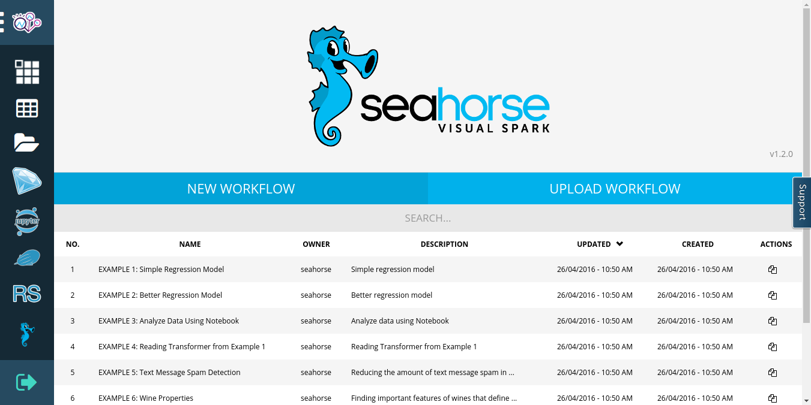

**Table of Contents**

* Table of Contents
{:toc}

## Overview

Seahorse is a data analytics platform that allows you to create Spark applications using a web-based interactive user interface.
You can use Seahorse on <a target="_blank" href="https://datascientistworkbench.com/">IBM Data Scientist Workbench</a>.
To do so, create an account and open your Seahorse instance by clicking the **Seahorse** button on the main page.
The purpose of Seahorse on Data Scientist Workbench is to present important features of Seahorse rather than
production use, this is why it is limited to a single-node Spark cluster.

  {: .centered-image .img-responsive}
  *Seahorse on Data Scientist Workbench Overview*

## Using Seahorse on Data Scientist Workbench

After creating an account at <a target="_blank" href="https://datascientistworkbench.com/">IBM Data Scientist Workbench</a>,
go to <a target="_blank" href="https://my.datascientistworkbench.com/tools/seahorse/">your Seahorse instance</a>.
You can also open Seahorse by clicking the **Seahorse** button on the main page.

On the main Seahorse page you can create a workflow or open one of the examples to see what is possible in Seahorse.
The examples cannot be modified - if you want to change or execute them, click the **CLONE** button
in the top panel.

Once you have opened the workflow (either by creating a new one or by cloning one of the examples)
press the **START EDITING** button to start editing the workflow. This will start the Seahorse Spark
application responsible for executing your workflow.

To find out more on what is possible in Seahorse, see the [Getting Started guide](../getting_started.html#use-seahorse).

## Platform Information

* Apache Spark, version {{ site.WORKFLOW_EXECUTOR_SPARK_VERSION }}
* Python, version 2.7
* Python libraries, including: NumPy, SciPy, Matplotlib, scikit-learn etc.

### Limitations

* Max DataFrame size: 500 MB
* Max number of rows in a DataFrame: 4 M
* Max number of columns in a DataFrame: 100
* Max row size: 1 MB
* Single-node Spark cluster
* Limited number of concurrently executed workflows

Above limitations refer only to Seahorse on Data Scientist Workbench.
To learn more about scaling up and using Seahorse in production,
see the [Enterprise](enterprise.html) page.


