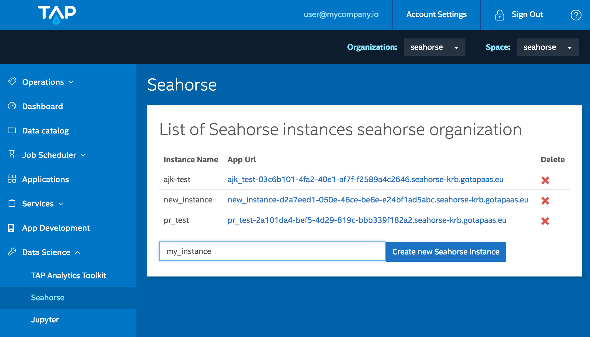
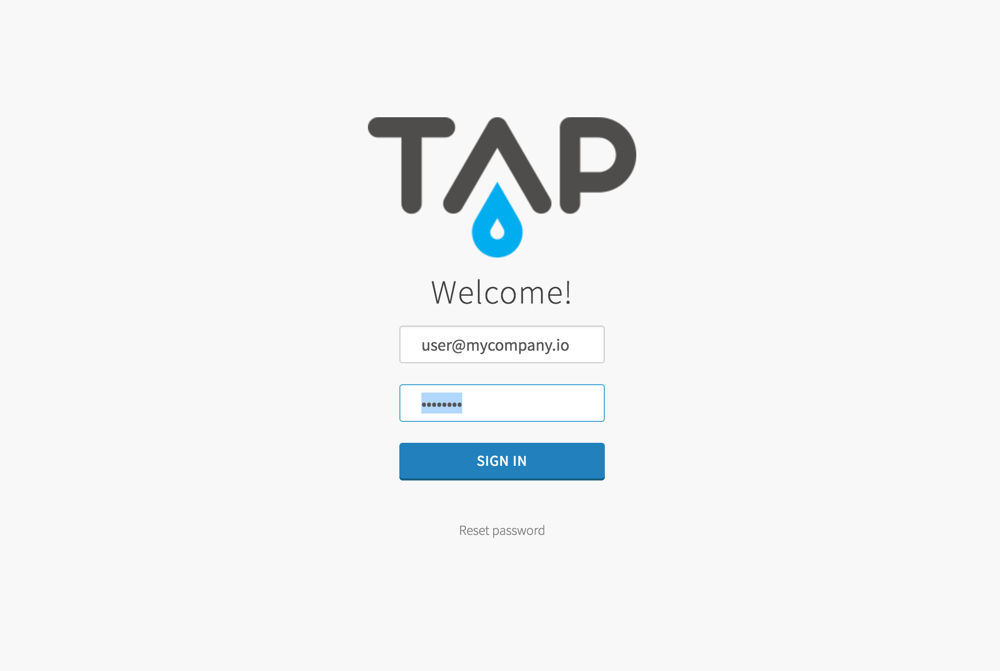
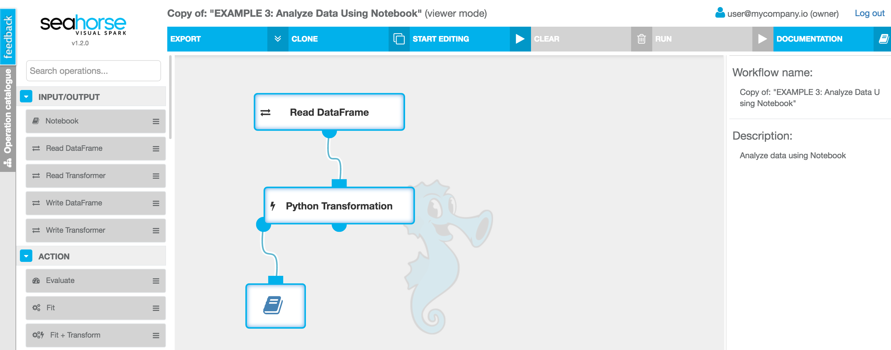

**Table of Contents**

* Table of Contents
{:toc}

## Overview

Seahorse is a data analytics platform that allows you to create Spark applications using a web-based
interactive user interface. You can use Seahorse on
<a target="_blank" href="http://trustedanalytics.org/">Trusted Analytics Platform</a>.

## Managing Seahorse Instances on TAP

Log in to your Trusted Analytics Platform deployment.
Next, select **Seahorse** from **Data Science** category in the left panel.
You will see a list of existing Seahorse instances.
You can also create a new instance by typing in
an instance name and clicking **Create new Seahorse instance**.

The Seahorse instances are bound to organization.
Only users from given organization can access them.

  {: .centered-image .img-responsive}
  *Managing Seahorse instances*

## Interacting with the Workflows List

After creating a Seahorse instance from Trusted Analytics Platform console,
open it by navigating to the **App Url** in your browser.

If you are opening Seahorse instance and you are not logged into TAP,
you will be redirected to TAP login page.
Opening Seahorse for the first time may also show a screen,
where you will have to grant permissions for Seahorse.

  {: .centered-image .img-responsive}
  *TAP login page*

On the main Seahorse page you will see the list of workflows
created by the users from your **organization** and some example workflows.
Each workflow has an owner - the user that created the workflow.
Please note that you can view all the listed workflows,
but you can only edit and run the workflows that you own.

If you found an interesting workflow, but you are not the owner,
you can clone it by clicking the
 button.
Once the workflow is cloned you can edit and run it.
You can also create new workflows from scratch by pressing the
**NEW WORKFLOW** button.

  {: .centered-image .img-responsive}
  *List of workflows*

## Editing the Workflow and Executing on Apache Spark

Once you have opened the workflow
(either by creating a new one or by cloning one of the examples)
press the **START EDITING** button to start editing the workflow.
This will start the Seahorse Spark application responsible for executing
your workflow.

  {: .centered-image .img-responsive}
  *Seahorse editor*

To find out more on what is possible in Seahorse,
see the [Getting Started guide](../getting_started.html#use-seahorse).

## Limitations

* On environments with Hadoop with enabled Kerberos, maximum duration of an
interactive session for a single workflow is limited to kerberos ticket timeout.
After this time, the Spark application responsible for executing
your workflow will stop working.

Above limitations refer only to Seahorse on Trusted Analytics Platform.
To learn more about scaling up and using Seahorse in production,
see the [Enterprise](enterprise.html) page.

	

		
Learn more about Seahorse enterprise-scale deployments
		- includes customized set-up, integration and 24/7 support.

	

	

		

			<a target="_blank" href="http://deepsense.io/about-us/contact/#contact-form-anchor">
			Contact us for details!
			</a>
		

	

