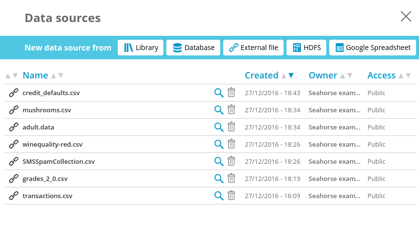
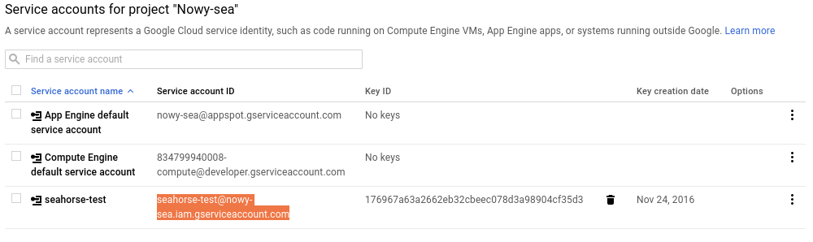

Seahorse supports Data Sources of the following types:

* **External File** - file accessibly via HTTP, HTTPS or FTP.
* **Library File** - file uploaded to Seahorse File Library
* **HDFS** - file on Hadoop Distributed File System
* **JDBC** - relational database supporting JDBC. [Requires adding JDBC driver JAR to Seahorse](#setting-up-jdbc-data-source-with-custom-jdbc-drivers)
* **Google Spreadsheet** - [Requires setting up a Google Service Account](#setting-up-a-google-spreadsheet-data-source)

Read more about [supported file formats](#supported-file-formats-details).

 

    

        
    

## Setting up JDBC Data Source with custom JDBC Drivers

Reading data from and writing data to JDBC-compatible databases is supported.

This functionality requires placing adequate JDBC driver JAR file to Seahorse shared folder `jars`.
That file placement has to be performed before starting editing workflow that uses JDBC connection
(otherwise, it will be required to stop running session and start it again).

## Setting up a Google Spreadsheet Data Source

Google Sheets Data Source has two parameters that require more detailed description:

* **Google Service Account Credentials JSON** - Seahorse must authorize itself as a Google User to the Google Services.  
  This JSON has all data required by Google Services for Seahorse to authorize itself.
* **Google Spreadsheet link** - note that this Google Spreadsheet must be shared with Seahorse Google User.

 

  

      
  

 

In the following sections you will learn how to set up a Google Service Account for the Seahorse instance and
how to share the spreadsheets with the Seahorse instance.

### Setting up a Google Service Account

1. Set up Google Project with Google Drive API enabled
   1. Go to <a target="_blank" href="https://console.developers.google.com/apis/api/drive"> Drive API Page </a>  
      If you don't have a Google Project yet - create a new one.
   2. Enable Google Drive API.
2. Set up Google Service Account
   1. Go to <a target="_blank" href="https://console.developers.google.com/iam-admin/serviceaccounts"> Service Accounts  Page</a>  
   2. Select your Google Project
   3. Create new Google Service Account.  
       **IMPORTANT**  - Tick **’Furnish a new private key’** option and select **JSON** key type.
      Store downloaded JSON credentials file securely. You will need that JSON credentials file later.  

    
   

      

          
      

   

    

3. Now you can include the JSON content into Google Service Account Credentials JSON field of the Data Source

### Sharing Google Spreadsheet with you Seahorse Instance

1. Obtain e-mail address of your Google Service Account from the
   <a target="_blank" href="https://console.developers.google.com/iam-admin/serviceaccounts">
   list of Service Accounts
   </a>

    
   

     

         
     

   

    

2. Share your Google Spreadsheet with your Google Service Account using e-mail address from step 1.

    
   

      

          
      

   

    

3. You can use Google Spreadsheet and you Google Service Account credentials to define a
Google Spreadsheet Data Source in Seahorse.

    
   

      

          
      

   

    

Now it's ready to use in the Seahorse!

## Supported File Formats Details

### `CSV`
<a target="_blank" href="https://en.wikipedia.org/wiki/Comma-separated_values">Comma-separated values</a>

When reading a CSV file, Seahorse infers column types.
If a column contains values of multiple types, the narrowest possible type will be chosen,
so that all the values can be represented in that type.

Empty cells are treated as ``null``, unless column type is inferred as a ``String`` - in this
case, they are treated as empty strings.

If the `convert to boolean` mode is enabled, the columns that contain only zeros, ones or empty values will be
inferred as `Boolean`.
In particular, a column consisting of empty cells will be inferred as ``Boolean`` with ``null`` values only.

While reading, Seahorse assumes that each row in the file has the same number of fields.
When this condition is not met, the behavior is undefined.

If the file defines column names, they will be used in the `DataFrame`.
If column's name is empty or absent, it will be named ``unnamed_X``,
where ``X`` is the smallest non-negative number such that column names are unique.

You can escape a column separator with a backslash.
For example, assuming that comma is the separator, the following line

<code>1,abc,"a,b,c","\"x\"",, z ," z&nbsp;&nbsp;"</code>

will be parsed as:

``1.0``  ``abc``  ``a,b,c``  ``"x"`` <code>&nbsp;</code> ``_z_``  ``_z__``

where ``_`` denotes a space and the fifth value is an empty string. Note, that ``"\"x\""`` is being
parsed as ``"x"``, since ``\"`` inside an already quoted value translates to ``"``.

### `PARQUET`
<a target="_blank" href="{{ site.SPARK_DOCS }}/sql-programming-guide.html#parquet-files">Parquet</a>

Note that `Parquet` format does not allow using any of the characters ``, ;{}()\n\t=`` in column names.

### `JSON`
<a target="_blank" href="https://en.wikipedia.org/wiki/JSON">JSON</a>

Note that `JSON` file format does not preserve the order of columns.

When saving a `DataFrame`, Seahorse converts `Timestamp` columns to `String` type
(values of that columns are converted to their string representations by Apache Spark).

`Null` values in JSON are omitted. This might result in schema mismatch if all values in particular
column are `null` (that column will be omitted in output JSON file).
