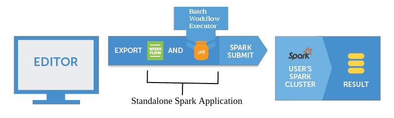

**Table of Contents**

* Table of Contents
{:toc}

## Overview

Additionally to the standard way,
[workflows](workflowfile.html) can be executed on a cluster in a batch mode.
It is an additional, very niche functionality reserved for advanced users.
If You are starting work with Seahorse, skip this document and visit
[Seahorse Bundled Image documentation](bundled_image_overview.html).

Seahorse Batch Workflow Executor {{ site.WORKFLOW_EXECUTOR_VERSION }}
is an <a target="_blank" href="http://spark.apache.org">Apache Spark</a>
application that allows user to execute [workflows](workflowfile.html) in batch mode.
This functionality can facilitate integration of Seahorse with other data processing systems.

  {: .centered-image .img-responsive}
  *Seahorse Batch Workflow Executor Overview*

## Download Seahorse Batch Workflow Executor

Compiled version of Seahorse Batch Workflow Executor is available at
[downloads page](/downloads.html).

## How to run Seahorse Batch Workflow Executor

Seahorse Batch Workflow Executor can be submitted to Spark cluster as any other Spark application.
Example spark-submit commands can be found in following subsections.
Replace `./bin/spark-submit` with a path to the script in Apache Spark's directory.
For more detailed information about submitting Spark applications, visit:
<a target="_blank" href="https://spark.apache.org/docs/{{ site.WORKFLOW_EXECUTOR_SPARK_VERSION }}/submitting-applications.html">https://spark.apache.org/docs/{{ site.WORKFLOW_EXECUTOR_SPARK_VERSION }}/submitting-applications.html</a>

#### Local Spark (single machine)

# Run Application Locally (on 8 cores)
./bin/spark-submit \
  --driver-class-path workflowexecutor.jar \
  --class io.deepsense.workflowexecutor.WorkflowExecutorApp \
  --master local[8] \
  --files workflow.json \
  workflowexecutor.jar \
    --workflow-filename workflow.json \
    --output-directory test-output \
    --python-executor-path workflowexecutor.jar


#### Spark Standalone Cluster

# Run on a Spark Standalone Cluster in Client Deploy Mode
./bin/spark-submit \
  --driver-class-path workflowexecutor.jar \
  --class io.deepsense.workflowexecutor.WorkflowExecutorApp \
  --master spark://207.184.161.138:7077 \
  --files workflow.json \
  workflowexecutor.jar \
    --workflow-filename workflow.json \
    --output-directory test-output \
    --python-executor-path workflowexecutor.jar


#### YARN Cluster

# Run on a YARN Cluster
export HADOOP_CONF_DIR=/opt/hadoop/etc/hadoop   # location of Hadoop cluster configuration directory
./bin/spark-submit \
  --driver-class-path workflowexecutor.jar \
  --class io.deepsense.workflowexecutor.WorkflowExecutorApp \
  --master yarn-cluster \  # can also be `yarn-client` for client mode
  --files workflow.json \
  workflowexecutor.jar \
    --workflow-filename workflow.json \
    --output-directory test-output \
    --python-executor-path workflowexecutor.jar


Option ``--python-executor-path`` is required (workflowexecutor.jar contains PyExecutor).
Option ``--files workflow.json`` is necessary to distribute workflow file to Spark cluster.
It is necessary to pass the same filename to ``--workflow-filename workflow.json`` option,
in order to tell Seahorse Batch Workflow Executor under which name it should look for workflow file.

If spark-assembly-{{ site.WORKFLOW_EXECUTOR_SPARK_VERSION }}-hadoop2.6.0.jar is already distributed
on HDFS cluster, it is possible to reduce time necessary for files propagation on YARN cluster.
Use spark-submit option
``--conf spark.yarn.jar=hdfs:///path/to/spark-assembly-{{ site.WORKFLOW_EXECUTOR_SPARK_VERSION }}-hadoop2.6.0.jar``
with proper HDFS path.
Spark assembly jar can be found in Spark {{ site.WORKFLOW_EXECUTOR_SPARK_VERSION }}
compiled for Hadoop 2.6.0 package.

## Custom JDBC Drivers

To allow usage of SQL databases for
[Read DataFrame](operations/read_dataframe.html)
and
[Write DataFrame](operations/write_dataframe.html),
proper JDBC driver has to be accessible during workflow execution.
This requirement can be satisfied by:

* adding JDBC jar library to cluster deployment,

* specifying JDBC jar during spark-submit command.

To specify JDBC jar during execution, use spark-submit option
``--jars path/to/jdbc-driver.jar``
with path to proper version of JDBC driver jar.
For more information on
``--jars`` option, please visit
<a target="_blank" href="http://spark.apache.org/docs/{{ site.WORKFLOW_EXECUTOR_SPARK_VERSION }}/submitting-applications.html#advanced-dependency-management">Apache Spark documentation</a>.

## Cassandra Configuration

To allow usage of Cassandra database as data source in I/O operations the following configuration
parameters need to be defined either in Spark configuration or passed to ``spark-submit``
using ``--conf`` option:

* ``spark.cassandra.connection.host``
* ``spark.cassandra.connection.port``
* ``spark.cassandra.auth.username``
* ``spark.cassandra.auth.password``

For more information, please visit
<a target="_blank" href="http://spark.apache.org/docs/{{ site.WORKFLOW_EXECUTOR_SPARK_VERSION }}/submitting-applications.html#launching-applications-with-spark-submit">Apache Spark documentation</a>.

## Seahorse Batch Workflow Executor Command Line Parameters

Detailed information about command line parameters can be obtained by executing command:

``java -classpath workflowexecutor.jar io.deepsense.workflowexecutor.WorkflowExecutorApp --help``

#### Command Line Parameters Details

| Argument                                                        | Meaning |
|:----------------------------------------------------------------|:--------|
| ``-w FILE`` ``--workflow-filename FILE``                    | Workflow filename. If specified, workflow will be read from passed location. The file has to be accessible by the driver. |
| ``-o DIR`` ``--output-directory DIR``                       | Output directory path. If specified, execution report will be saved to passed location. Directory will be created if it does not exist. |
| ``-e NAME=VALUE`` ``--extra-var NAME=VALUE``                | Extra variable. Sets extra variable to specified value. Can be specified multiple times. |
| ``-m HOST`` ``--message-queue-host HOST``                   | Address of message queue host. |
| ``-p PATH`` ``--python-executor-path PATH``                 | Path to PyExecutor code (included in workflowexecutor.jar). |

* **NOTE:** Parameter ``-w FILE`` (or its long name) needs to be specified.
* **NOTE:** Both parameters ``-w FILE`` and ``-o DIR`` (or their long names) have to be specified.
* **NOTE:** When using ``--extra-var`` option,
if variable name or value contains special characters (e.g. space),
it have to be surrounded by quotation marks.

## Seahorse Batch Workflow Executor Logs

Depending on Spark application deployment mode and cluster configuration, execution logs can be
redirected to several locations, e.g.:

* Submitter's console (running Spark locally or when deploy mode is `client`)

* YARN logs directory on cluster nodes

* Spark logs directory on cluster nodes

* HDFS directory

You have to look for detailed information about logging with regard to Your cluster configuration,
for running Spark on YARN, visit:
<a target="_blank" href="http://spark.apache.org/docs/{{ site.WORKFLOW_EXECUTOR_SPARK_VERSION }}/running-on-yarn.html#debugging-your-application">http://spark.apache.org/docs/{{ site.WORKFLOW_EXECUTOR_SPARK_VERSION }}/running-on-yarn.html#debugging-your-application</a>,
for Spark Standalone cluster, visit:
<a target="_blank" href="http://spark.apache.org/docs/{{ site.WORKFLOW_EXECUTOR_SPARK_VERSION }}/spark-standalone.html#monitoring-and-logging">http://spark.apache.org/docs/{{ site.WORKFLOW_EXECUTOR_SPARK_VERSION }}/spark-standalone.html#monitoring-and-logging</a>.

For details on how Spark runs on clusters, visit:
<a target="_blank" href="http://spark.apache.org/docs/{{ site.WORKFLOW_EXECUTOR_SPARK_VERSION }}/cluster-overview.html">http://spark.apache.org/docs/{{ site.WORKFLOW_EXECUTOR_SPARK_VERSION }}/cluster-overview.html</a>.
