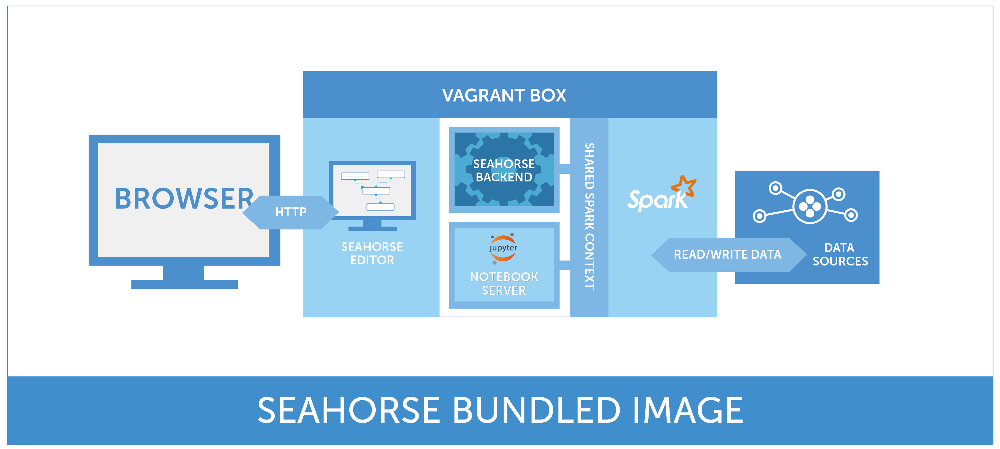

**Table of Contents**

* Table of Contents
{:toc}

## Overview

Seahorse is a data analytics platform that allows you to create Spark applications using a web-based interactive user interface.
Seahorse Desktop is a bundled image - a virtual machine containing all necessary components to easily run Seahorse.
The purpose of Seahorse Desktop is to present important features of Seahorse rather than
production use, this is why it is limited to a single-node Spark cluster.
To learn more about scaling up and using Seahorse in production, see the
<a href="https://seahorse.deepsense.io/enterprise.html">Enterprise</a> page.

  {: .centered-image .img-responsive}
  *Seahorse Bundled Image Overview*

### Seahorse Desktop Limitations

* Max DataFrame size: 500 MB
* Max number of rows in a DataFrame: 4 M
* Max number of columns in a DataFrame: 100
* Max row size: 1 MB

Above limitations refer only to Seahorse Desktop.
To learn more about scaling up and using Seahorse in production,
see the <a href="https://seahorse.deepsense.io/enterprise.html">Enterprise</a> page.

	

		
Learn more about Seahorse enterprise-scale deployments
		- includes customized set-up, integration and 24/7 support.

	

	

		

			<a target="_blank" href="http://deepsense.io/about-us/contact/">
			Contact us for details!
			</a>
		

	

### Bundled Dependencies

* Apache Spark, version 1.6.0
* Python, version 2.7.6
* NumPy, version 1.8.2
* JDBC drivers:

    -   MySQL, version 5.1.38
    -   PostgreSQL, version 9.4.1207

## Running Seahorse Desktop

### Minimum Hardware Requirements
* 4 GB of a free disk space
* 4 GB of RAM
* A processor with virtualization support

### Software Requirements
* <a target="_blank" href="https://www.vagrantup.com/">Vagrant</a> (tested on version 1.8.1)
* <a target="_blank" href="https://www.virtualbox.org/">VirtualBox</a> (tested on version 5.0.10, there is an issue with version 5.0.12)
* <a target="_blank" href="https://www.google.com/chrome/">Google Chrome</a> (version 40+)

### Downloading Seahorse Desktop

A Vagrantfile that describes the image containing all necessary components of Seahorse can be downloaded from
<a target="_blank" href="https://seahorse.deepsense.io/downloads.html">Try Seahorse</a>.
Seahorse bundled image is based on <a target="_blank" href="http://www.ubuntu.com/">Ubuntu</a> and contains
a single-node Spark 1.6 cluster.

### Run Command
To run Seahorse Desktop you have to navigate to the directory where you downloaded the Vagrantfile and execute:

    vagrant up

After that you can navigate to <a target="_blank" href="{{ site.SEAHORSE_EDITOR_ADDRESS }}">Seahorse Editor</a>
at <a target="_blank" href="http://172.28.128.100:8000/">http://172.28.128.100:8000/</a>.

### Shutdown Command
To stop Seahorse Desktop you need to execute:

    vagrant halt

## Making Local Files Available in Seahorse
By default, Vagrant mounts the host directory where virtual machine was started to `/vagrant` directory on the virtual machine.
If you want to use data sets stored as local files, you need to copy them to the directory where you started your virtual machine.

Example:

    cp /path/to/the/dataset/data.csv /path/to/the/dir/where/vagrantfile/is/

  {: .centered-image .img-responsive}
  *Filled parameters of Read DataFrame operation*

## Troubleshooting
* If you cannot start Seahorse virtual machine, please check your BIOS if you have virtualization enabled.
* In case of unexpected errors during Seahorse usage or the Editor becoming unresponsive,
try rebooting the Seahorse VM by running:

        vagrant reload

Bug reports and all other feedback can be sent using the
<a target="_blank" href="http://feedback.seahorse.deepsense.io">Feedback</a>
option in Seahorse Editor in the upper-right corner.

### Note for Windows users

By default, Vagrant keeps boxes and configuration in `%HOMEPATH%/.vagrant.d`,
but cannot access it when a `%HOMEPATH%` includes non-ASCII characters.
It's a well known <a target="_blank" href="https://github.com/mitchellh/vagrant/issues/4966">Vagrant bug</a> and results in:

    > vagrant up
    ...
    Failed writing body (0 != 16383)

There are at least two ways to overcome the problem:

* Change user name to one with ASCII characters only
* Change Vagrant home directory to one with ASCII characters only:

        setx VAGRANT_HOME=c:\.vagrant.d

## Upgrading Seahorse Desktop To the Latest Version
If you want to replace your Seahorse with the newest version you need to invoke
the commands below. ***Please keep in mind that the current version of Seahorse will be
completely erased, meaning that all workflows stored in Seahorse will be deleted, too.***

# stop and delete current Seahorse
vagrant destroy
# remove current seahorse box
vagrant box remove seahorse-vm
# remove older Vagrantfile
rm Vagrantfile
# get the newest Vagrantfile (please check Downloads page)
# wget is a simple command-line network downloader,
# but you can also download Vagrant file using a web browser
wget http://path.to.the.newest.vagrantfile
# start the newest Seahorse
vagrant up

