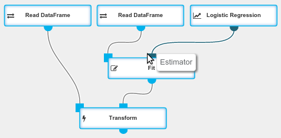

## Introduction

An `Estimator` is a generalization of a machine learning algorithm. It consumes a
[DataFrame](../classes/dataframe.html) and produces a
[Transformer](../operations/transform.html).
`Estimators` can be executed using a [Fit](../operations/fit.html) operation.

  {: .centered-image .img-responsive}
  *Estimator usage diagram*

## Example

A [Logistic Regression](../operations/logistic_regression.html) is an operation that outputs an untrained model, which is an `Estimator`.
It is passed to a `Fit` operation. We get a trained model as a result of fitting.
The trained model is a `Transformer` that can be used in a [Transform](../operations/transform.html) operation for scoring on new data.

{: .img-responsive .centered-image .spacer}
