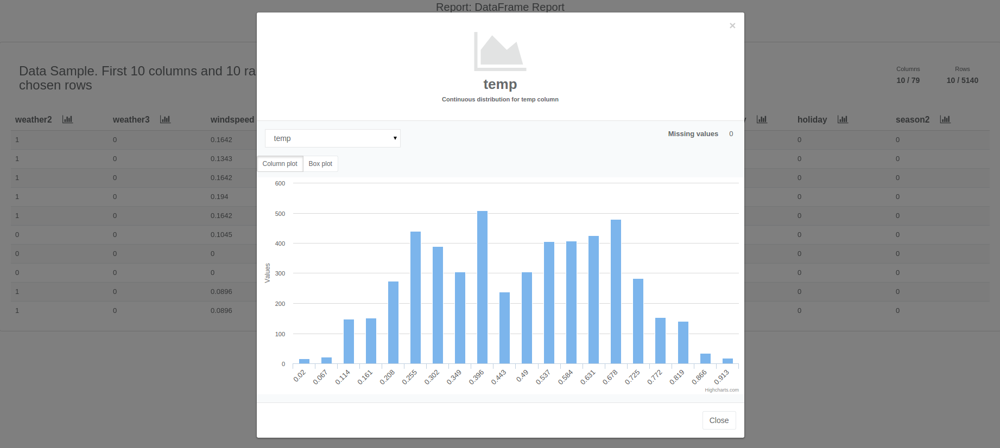
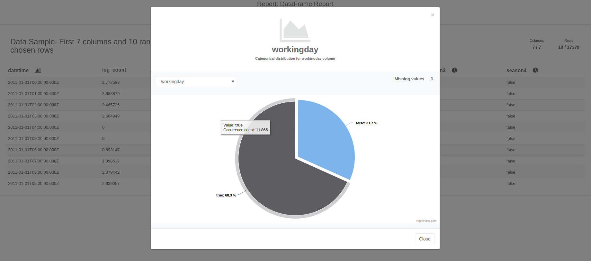
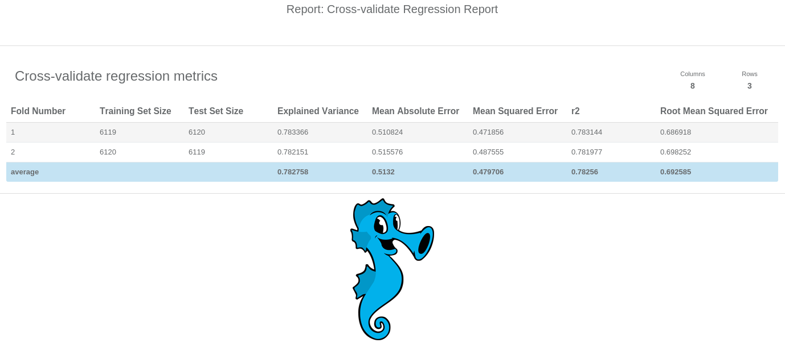

A `Report` gathers concise summary of any entity that can be easily presented in a human-friendly manner.
Conciseness of report allows for presenting it to user via browser even for big data Entities.

A report can contain a set of calculated descriptive statistics
(e.g. for a [DataFrame](dataframe.html))
that include column distributions, missing value counts etc.
Reports may contain data presentable through a chart,
in a tabular form or through an interactive front-end presentation.

### Report Visualization Examples

&nbsp; &nbsp; &nbsp; &nbsp;

