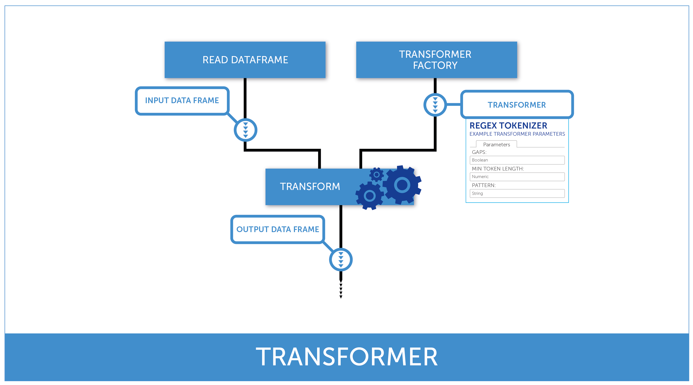
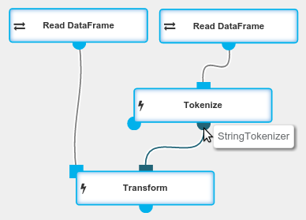

## Introduction

A `Transformer` is an abstraction of direct data processing. It consumes a [DataFrame](../classes/dataframe.html) and produces a [DataFrame](../classes/dataframe.html).

`Transformers` can be executed using a [Transform](../operations/transform.html) operation.

  {: .centered-image .img-responsive .spacer}
  *Transformer usage diagram*

## Example

A [Tokenize](../operations/tokenize.html) is an operation that outputs a transformed `DataFrame` on its left output port
and a `StringTokenizer` (a `Transformer`) on its right output port. Passing a `Transformer`
to a `Transform` operation allows to perform the `StringTokenizer` on another `DataFrame`.

{: .img-responsive .centered-image .spacer}
