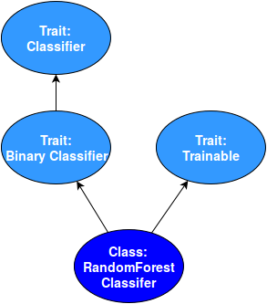

Deeplang is a
[visual programming language](https://en.wikipedia.org/wiki/Visual_programming_language)
that lets users create advanced data processing and machine learning workflows.
Deeplang workflow is a graph of connected operations,
which are consuming and producing entities.

### Entities, Classes and Traits
Entities are the most crucial part of Deeplang. They represent data that is being processed in a workflow.

Entities are immutable - they do not have state that could be changed. Any modifications are performed by creating new instances based on old ones.

Each entity has certain _class_ - this concept is similar to class in object-oriented programming languages. A class can have _traits_ - similar to interfaces in Java or traits in Scala. Traits can be viewed as properties shared by all entities of the same class. Classes and traits form hierarchy - when a class has a trait, it means this class _inherits_ from this trait. A trait can inherit from other trait, but never from a class. When a class inherits from a trait, it also _inherits_ from all of traits that this trait is inheriting from.

#### Example
`Classifier` is an example of a trait. If an entity has this trait, it means it is associated with machine learning classification task. `BinaryClassifier` is another trait. `BinaryClassifier` inherits from `Classifier`. `RandomForestClassifier` is a class that inherits from trait `BinaryClassifier`. It means that `RandomForestClassifier` has also the `Classifier` trait.

Entities of the `RandomForestClassifier` class can be used to train prediction model, therefore this class also has the `Trainable` trait.

<!--

  {: .centered-image}

-->

### Operations
Operations are the base building blocks for workflows. Operations serve mainly to produce new entities. Each operation has
$$n$$ input ports, $$m$$ output ports and configurable parameters. Ports are indexed from $$0$$. In order to be executed, an operation needs one entity to be placed in each of its input ports. Additionally, all required parameters have to be filled. When an operation is executed, it produces one entity for each of its output ports.It also can have some side effects (like logging or exporting an entity to an external destination), but it never modifies its input entities (as they are immutable).

  {: .centered-image}

One can think about an operation as a function that receives a tuple of entities and parameters' values, and returns a tuple of entities.

$$Operation: (entity_0, entity_1, …, entity_{n-1}, parameters) \rightarrow (entity_0, entity_1, ... , entity_{m-1})$$

#### Example
`DataFrame` is an entity. It represents object that contains data grouped in columns (similarly to R or Spark dataframes).

`ReadDataFrame` is an operation with no input ports and one output port. It is able to read data from an external source and form it into DataFrame that it will produce in output port.

`ProjectColumns` is an operation with one input and one output port. It selects a subset of `DataFrame` columns and produces a new `DataFrame` which contains only selected columns.

`WriteDataFrame` is an operation with one input port and no output ports. It is used to export content of a `DataFrame` to external destination. Note that, as it has no output, WriteDataFrame is interesting only because of it’s side effects.

### Parameters

Operation can have a set of named parameters. Parameters are modifying the behavior of the operation.

#### Example
In `ReadDataFrame`, parameters can be used to specify the source of data. In `ProjectColumns`, parameters are used to specify the set of selected columns.

List of currently supported types of parameters can be found [here](parameters.html).

### Type Qualifiers
Each port of an operation has associated type qualifier. A type qualifier of an input port informs what type of entity can be placed in this port. A type qualifier of an output port informs what is a guaranteed type of entity that will be produced in this port.

#### Example 1
The `Project Columns` operation accepts only  DataFrames in its input port. Therefore, the type qualifier of its single input port is `DataFrame`. `Project Columns` also produces DataFrames in its output port. Therefore, the type qualifier of its output port is `DataFrame`.

Type qualifier can be either a concrete class, or a set of traits. In the second case, entity must have all traits specified in the type qualifier to meet its requirements.

#### Example 2
The `Train Regressor` operation serves to create machine learning regression model based on a training `DataFrame`. It has two input ports and one output port. The type qualifier of the input port with number 0 is: `Regressor + Trainable`. This means that only entities having classes with both `Regressor` and `Trainable` traits can be placed in this port. The type qualifier of the output port is `Regressor + Scorable`. This means that each entity produced by this operation will have both `Regressor` and `Scorable` traits.

$$Train Regressor: ([Regressor + Trainable], DataFrame) \rightarrow ([Regressor + Scorable])$$

### Workflows
Deeplang workflow is a directed acyclic graph of connected operations. It represents what actions are to be performed on data.

An entity produced by one operation can be placed as argument in a port of other operation. This can be represented as a connection between output port of the first operation and input port of the second one. A workflow is formed from a set of operations and connections between them. Note that from one output port there can be many connections to many different input ports - it means that entity produced by an operation will be placed as argument in many different operations. However, there can only be one connection incoming to an input port.

In order to be executed, a workflow must be correct, i.e.:

* it does not contain cycle
* parameters of all operations must be correct
* each input port must have exactly one incoming connection
* classes of entities passed between ports must meet requirements of these ports' type qualifiers

Note that if two branches of workflow do not depend on each other, they can be executed in parallel.

#### Example

  

In the example, there is a simple  presented. It reads a `DataFrame` from some external source and then passes it to the `Split` operation. This operation splits `DataFrame` by rows, producing two new `DataFrame`s. One is immediately written at some destination. The other one is projected to the selected subset of its columns, and than written. Note, that writing of left `DataFrame` can be executed simultanously with projecting and writting of right `DataFrame`.
