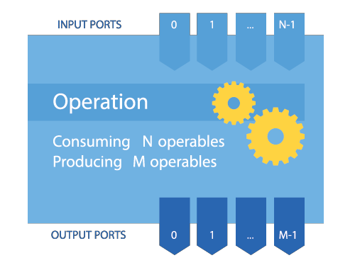
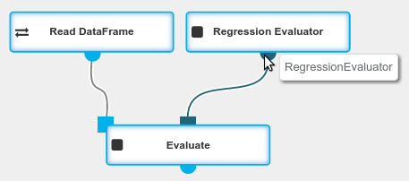

Deeplang is a
<a target="_blank" href="https://en.wikipedia.org/wiki/Visual_programming_language">visual programming language</a>
that lets users create data processing and machine learning workflows, from simple to advanced ones.
Deeplang workflow is a graph of connected operations, which are consuming and producing [entities](deeplang_overview.html#entities-and-classes).

### Entities and Classes
`Entities` are the most crucial part of Deeplang. They represent objects that are being passed between
operations, e.g. [DataFrame](classes/dataframe.html), [Transformer](classes/transformer.html),
[Estimator](classes/estimator.html), [Evaluator](classes/evaluator.html).

`Entities` are immutable - they do not have a state that could be changed. Any modifications are
performed by creating new instances based on the old ones.

Each `entity` has a certain `class` - this concept is similar to class in object-oriented programming
languages.

### Operations
Operations are base building blocks for workflows. Their purpose is to produce new `entities`.
Each operation has $$n$$ input ports, $$m$$ output ports and a set of configurable parameters.
Ports are indexed from $$0$$. In order to be executed, an operation needs one `entity` to be placed in
each of its input ports. In addition, all required parameters have to be filled. When an operation
is executed, it produces one `entity` for each of its output ports. It also can perform side effects
(like logging or writing data to databases and filesystems), but it never modifies its input
`entities` (as they are immutable).

  {: .centered-image .img-responsive}
  *Operation schema*

You can think about an operation as a function that receives a tuple of `entities` and parameters'
values and returns a tuple of `entities`.

$$Operation: (entity_0, entity_1, …, entity_{n-1}, parameters) \rightarrow (entity_0, entity_1, ... , entity_{m-1})$$

#### Example
[DataFrame](classes/dataframe.html) is an `entity`. It represents an object that contains data grouped
in columns (similarly to R or Spark dataframes).

[Read DataFrame](operations/read_dataframe.html) is an operation with no input ports and one output
port. It is able to read data from an external source and form it into a `DataFrame`. The `DataFrame` is
produced in an output port.

[Filter Columns](operations/filter_columns.html) is an operation with one input and two output ports.
It selects a subset of `DataFrame` columns and produces a new `DataFrame` which contains only
selected columns. It returns result `DataFrame` on output port 0 and `ColumnFilterer` `Transformer`
that can be used to perform the same transformation on a different `DataFrame` on output port 1.

[Write DataFrame](operations/write_dataframe.html) is an operation with one input port and no output
ports. It is used to export content of a `DataFrame` to an external destination. Note that, as it
has no output, `Write DataFrame` is interesting only because of it’s side effects (the data that's
being written to the destination).

### Parameters
An operation can have a set of named parameters. Parameters are modifying the behavior of the
operation. The list of parameter types can be found [here](parameter_types.html).

#### Dynamic parameters
Higher-order operations, such as: [Fit](operations/fit.html), [Transform](operations/transform.html),
[Fit+Transform](operations/fit_plus_transform.html), [Evaluate](operations/evaluate.html),
[Grid Search](operations/grid_search.html) have dynamic parameters, which are dependent on nodes
connected to the operation's input ports. Dynamic parameters allow user to override input
operations' parameters.

#### Example 1 (simple parameters)
[Read DataFrame](operations/read_dataframe.html) has parameters: `data storage type`, `source`,
`format` that can be used to specify the source of data.

#### Example 2 (dynamic parameters)
[Fit](operations/fit.html) is an operation with dynamic parameters. When `Fit`'s right input port is
not connected, the operation has no parameters. When [Linear Regression](operations/linear_regression.html)
is connected to `Fit`'s right input port, all parameters of `Linear Regression` are available in `Fit`.
Default parameter values are the same as in the input operation and they can be overridden.

### Type Qualifiers
Each port of an operation has associated type qualifier. A type qualifier of an input port informs
what type of an `entity` can be placed in this port. A type qualifier of an output port informs what is
a guaranteed type of an `entity` that will be produced in this port.

#### Example 1
The [Filter Columns](operations/filter_columns.html) operation accepts only  `DataFrames` in its
input port. Therefore, the type qualifier of its single input port is `DataFrame`. `Filter Columns`
also produces `DataFrames` in its first output port. Therefore, the type qualifier of its first
output port is `DataFrame`.

#### Example 2
The `Fit` operation serves to create a machine learning model based on
a training `DataFrame`. It has two input ports and one output port. The type qualifier of the first
input port is: `Estimator`. This means that only `entities` extending `Estimator` `class` can be placed
in this port. The type qualifier of the output port is `Transformer`. This means that each `entity`
produced by this operation will extend `Transformer` `class`.

$$Fit: (Estimator, DataFrame) \rightarrow Transformer$$

### Special-purpose Entities

Special-purpose `entities` include `Transformers`, `Estimators` and `Evaluators`.

One can think about `Transformers`, `Estimators` and `Evaluators` as encapsulated operations that
can be input to higher-order operations.

These categories are analogous to `classes` in
<a target="_blank" href="http://spark.apache.org/docs/latest/ml-guide.html#main-concepts">Spark ML API</a>.
Similarity of Deeplang and Spark class hierarchies gives multiple benefits:

* Deeplang concepts are very easy to learn for users already familiar with Spark ML.
* PySpark code can be reused in Seahorse's custom operations.
* Seahorse can be easily updated to new versions of Spark.

#### Transformers

$$Transformer: DataFrame \rightarrow DataFrame$$

`Transformer` is an abstraction of direct data processing. It consumes a `DataFrame` and produces
a `DataFrame`.

`Transformers` can be executed by the `Transform` higher-order operation.

#### Example

[Tokenize](operations/tokenize.html) is an operation that outputs transformed `DataFrame` on its
left output port and a `StringTokenizer` `Transformer` on its right output port. Passing
`Transformer` to `Transform` allows to perform `Tokenize` on another `DataFrame`.

{: .img-responsive}

#### Estimators

$$Estimator: DataFrame \rightarrow Transformer$$

`Estimator` is a generalization of a machine learning algorithm. It consumes a `DataFrame` and
produces a `Transformer`.

`Estimators` can be executed by `Fit` generic operation.

#### Example

[Logistic Regression](operations/logistic_regression.html) is an operation that outputs an untrained
model, which is an `Estimator`. It is passed to `Fit` operation. We get a trained model as a result
of fitting. The trained model is a `Transformer` that can be used in `Transform` operation for
scoring on new data.

{: .img-responsive}

#### Evaluators

$$Evaluator: DataFrame \rightarrow MetricValue$$

`Evaluator` is an abstraction of calculating `DataFrame` metrics. It consumes a `DataFrame` and
produces a [MetricValue](classes/metric_value.html).

`Evaluators` can be executed by `Evaluate` generic operation.

#### Example

[Regression Evaluator](operations/regression_evaluator.html) is an operation that outputs
an `Evaluator`. It is passed to `Evaluate` operation which calculates regression metrics on
a previously scored `DataFrame`.

{: .img-responsive}

### Workflows
Deeplang workflow is a directed acyclic graph of connected operations. It represents what actions
are to be performed on data.

An `entity` produced by one operation can be placed as an argument in a port of another operation.
This can be represented as a connection between the output port of the first operation and input
port of the second one. A workflow is formed from a set of operations and connections between them.
Note that from one output port there can be many connections to many different input ports - it
means that the entity produced by an operation will be placed as an argument in many different
operations. However, there can only be one connection incoming to an input port.

In order to be executed, a workflow must be correct, i.e.:

* it does not contain a cycle,
* parameters of all operations must be correct,
* each input port must have exactly one incoming connection,
* `classes` of `entities` passed between ports must meet requirements of these ports' type qualifiers.

Note that if two branches of workflow do not depend on each other, they can be executed in parallel.

#### Example

  {: .centered-image .img-responsive}

In the example, there is a simple workflow presented. It reads a `DataFrame` from some external
source and then passes it to the [Split](operations/split.html) operation. This operation splits
`DataFrame` by rows, producing two new `DataFrame`s. One is immediately written at some destination.
The other one is projected to the selected subset of its columns, and then written. Note, that the
writing of the left `DataFrame` can be executed simultaneously with projecting and writing of the
right `DataFrame`.
