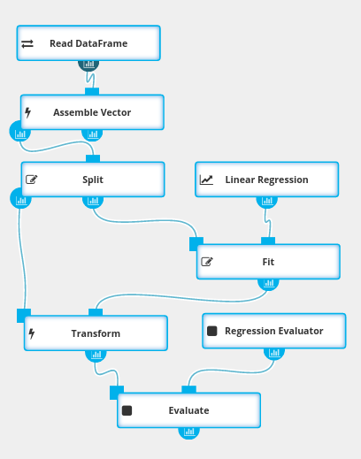
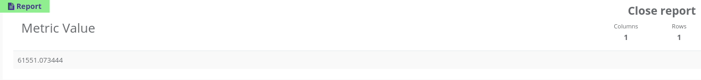
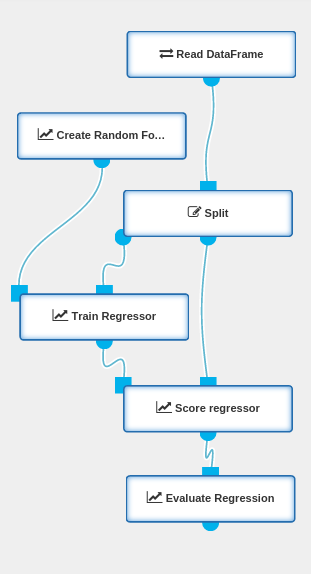
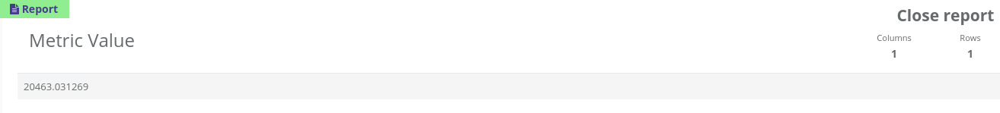
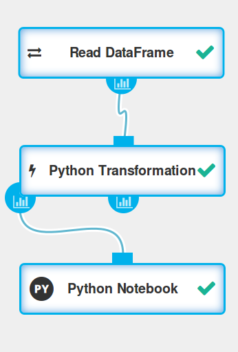
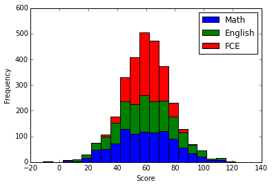

**Table of Contents**

* Table of Contents
{:toc}

## Example 1 - Build a simple regression model

The goal of this exercise is to build a model predicting apartments prices
basing on 3 apartments features:
<code>beds</code>, <code>baths</code> and <code>sq_ft</code>.

The dataset [transactions.csv](/_static/transactions.csv) has 5 columns and 1000 rows
(header row and 999 data rows).
Each row provides information about the apartment:
city, number of bedrooms, number of bathrooms, size of the apartment (in square feets) and its price.

    city,beds,baths,sq_ft,price
    CityB,4,1,1294,529377
    CityC,4,2,1418,574485
    CityC,2,1,600,221661
    ...

To build the model we will split our initial dataset
into two parts - training and validation sets. We will train the
Linear Regression model using training set.
The model will be scored (against validation part of the dataset) and report of
the scoring will be produced (model performance report).

### Build workflow

1. Create an empty workflow
   * Go to <a target="_blank" href="{{ site.SEAHORSE_EDITOR_ADDRESS }}">Seahorse Editor</a> and click **New workflow**
   * Put <code>machinelearning1</code> in the **Name** section - setting a meaningful name will help
     when looking for a workflow in workflow list
   * Press the **create** button

2. Set the source of your data
   * Drag [Read DataFrame](operations/read_dataframe.html) operation to your canvas
   * Click on **Read DataFrame** operation - menu on the right will show its parameters
   * Put <code>https://seahorse.deepsense.io/_static/transactions.csv</code> in the **SOURCE**
     parameter - once executed, the dataset will be downloaded from that location

3. Select features that will be used to train and evaluate model and create a vector column
   containing selected features' values
   * Drag [Assemble Vector](operations/assemble_vector.html) to your canvas
   * In the **INPUT COLUMNS** section:
     * Click **Edit selection**, this will open selection window for **INPUT COLUMNS** parameter
     * Select **Excluding** mode in the top-right corner - this will include in the features
       column all values except the ones selected
     * Add <code>city</code> and <code>price</code> to the list - we have to exclude <code>city</code>
       column, because it doesn't contain numeric values and <code>price</code>, because it contains
       the actual results
   * Put <code>features</code> in the **OUTPUT COLUMN** parameter - the operation will add a column
     with this name to the dataset

4. Split the dataset into training and test sets
   * Drag [Split](operations/split.html) to your canvas
   * Put <code>0.7</code> in the **SPLIT RATIO** parameter - we will use 30% of the data for
     training and 70% for evaluation
   * Put <code>0</code> in the **SEED** parameter - the split operation itself is not deterministic.
     You can put any value here - it will split the dataset differently, but in the same proportions.

5. Use linear regression algorithm
   * Drag [Linear Regression](operations/linear_regression.html) to your canvas
   * In the **FEATURES COLUMN** section:
     * Click **Edit selection**, this will open selection window for **FEATURES COLUMN** parameter
     * Click at **Select by name** and put <code>features</code> in the text field - this will use
       the column created in step 3
   * In the **PREDICTION COLUMN** section put <code>prediction</code> - this new column will contain
     predicted values
   * In the **LABEL COLUMN** section:
     * Click **Edit selection** - this will open selection window for **LABEL COLUMN** parameter
     * Click at **Select by name** and put <code>price</code> in the text field - <code>price</code>
       column contains the actual values that we will evaluate out model against

6. Prepare operations for model fitting and transforming the dataset
   * Drag [Fit](operations/fit.html) to your canvas - this operation will be used to fit model to
     the training set
   * Drag [Transform](operations/transform.html) to your canvas - it will transform the dataset
     using the model fitted in the previous step

7. Select evaluation method
   * Drag [Evaluate](operations/evaluate.html) to your canvas
   * Drag [Regression Evaluator](operations/regression_evaluator.html) to your canvas
     * This operation will create an evaluator for regression algorithms, we will use the default
       evaluation metric (RMSE)
     * Put <code>prediction</code> in the **PREDICTION COLUMN** parameter
     * Put <code>price</code> in the **LABEL COLUMN** parameter
     * The evaluator will measure the error between <code>price</code> and <code>prediction</code>
       columns

8. Connect operations as presented in the picture

### Execute workflow
{:.no_toc}

* Click on the **Evaluate** node.
  This will mark the node to be executed. All required predecessor nodes will be executed as well.
* Press **RUN** button from the top menu.
  This operation will execute the workflow and may take some time. During the execution you can see
  the progress by observing icons on operation nodes. The operation being executed will have a
  spinning wheel on the right side. Completed operations are marked with green ticks. The workflow
  execution will be finished when the selected Evaluate node's execution is completed.

### View the reports
{:.no_toc}

Click on the report icon under the **Evaluate** node. Report panel with evaluation metrics
will be shown at the bottom of the screen. These metrics are showing our model's performance.
In the next example we will try to improve these metrics.

  {: .centered-image .img-responsive}

## Example 2 - Build a better model

The goal of this exercise is to improve our previous models performance.
In previous example we only used 3 features of the apartments:
<code>beds</code>, <code>baths</code> and <code>sq_ft</code>.
We will now add the <code>city</code> feature to the model.

In our dataset <code>city</code> is a text column,
and [Linear Regression](operations/linear_regression.html)
algorithm only works on numerical columns.
Quick view on the <code>city</code> column values suggests it is a categorical column - column
containing only a small, fixed set of different values. We will process this feature before
executing linear regression algorithm on the data.

### Update workflow

1. Open workflow from **Example 1** in the <a target="_blank" href="{{ site.SEAHORSE_EDITOR_ADDRESS }}">Seahorse Editor</a>

2. Convert <code>city</code> feature to categorical
   * Add [String Indexer](operations/string_indexer.html) to the canvas
     * This operation will create a new column, <code>city_index</code>, with numbers representing
       text values from the original column
     * Select <code>Transform one column</code> in **ONE OR MANY** selector
     * Select <code>city</code> in the **INPUT COLUMN**
     * Select <code>create a new column</code> in **TRANSFORM IN PLACE** selector
     * Put <code>city_index</code> in the **OUTPUT COLUMN**
   * Add [One Hot Encoder](operations/one_hot_excoder.html) to the canvas
     * This operation will create separate columns for each value from the original column
     * Select <code>Transform one column</code> in **ONE OR MANY** selector
     * Select <code>city_index</code> in the **INPUT COLUMN**
     * Select <code>create a new column</code> in **TRANSFORM IN PLACE** selector
     * Put <code>city_encoded</code> in the **OUTPUT COLUMN**
   * As a result of executing the two operations above, in our dataset we will have additional
     columns with values <code>0</code> or <code>1</code> for each possible value of <code>city</code>
     column.

3. Update connections between Read DataFrame and Assemble Vector nodes as shown in the picture.
   This will execute the operations described in step 2 after reading the dataset and before
   assembling the <code>features</code> column used for model fitting and evaluation.

### Execute workflow
{:.no_toc}

* Click on the **Evaluate** node
* Press **RUN** button from the top menu

### View the reports
{:.no_toc}

Click on the report icon under the **Evaluate** node. As you can see the model performance is much
better than in the previous example.

  {: .centered-image .img-responsive}

## Example 3 - Analyze data using Notebook

The goal of this exercise is to show how to use the [Notebook](operations/notebook.html)
and interactively analyze data.

### Build workflow

* Create an empty workflow
  * Go to <a target="_blank" href="{{ site.SEAHORSE_EDITOR_ADDRESS }}">Seahorse Editor</a> and click **New workflow**
  * Put <code>notebook1</code> in the **Name** section
  * Press the **create** button

* Set the source of your data
  * Drag [Read DataFrame](operations/read_dataframe.html) operation
    to your canvas
  * Put <code>https://s3.amazonaws.com/workflowexecutor/examples/data/grades.csv</code>
    in the **SOURCE** parameter - the dataset will be downloaded from this location

* Process the dataset before opening the notebook
  * Drag [Custom Python Operation](operations/custom_python_operation.html) to your canvas
  * Put the following code in the **CODE** parameter, in order to extract the <code>FCE</code> value
    from <code>Certificates</code> column to a separate column:


import json
from pyspark.sql.types import *

def transform(dataframe):
    def get_fce(js):
        return float(json.loads(js)['Cambridge']['FCE'])

    sqlContext.registerFunction(
      "get_fce", get_fce, FloatType())
    sqlContext.registerDataFrameAsTable(dataframe, "df")
    return sqlContext.sql(
      "SELECT Math, English, get_fce(Certificates) as FCE FROM df")


* Use Notebook to interactively analyze data
  * Drag [Notebook](operations/notebook.html) to your canvas
  * Connect operations as presented in the picture

### Execute and edit notebook

* Select the created Notebook node and click **run** button. This will execute the Notebook node and
  all required predecessor nodes.
* Once the workflow execution is finished, select Notebook node and click **Edit code** in the right
  panel. A notebook window will be shown, where you can write Python code snippets, execute them and
  see the execution results.

#### Use Spark Context
{:.no_toc}

The Spark Context is available in the notebook as a global variable `sc`.

<table>
<tr>
<td><b>In:</b></td>
<td>

sc.parallelize([1,2,3,4,5]).map(lambda x: x*x).collect()

</td>
</tr>

<tr>
<td><b>Out:</b></td>
<td>
[1, 4, 9, 16, 25]
</td>
</tr>
</table>

#### Use SQLContext
{:.no_toc}

SQLContext can be accessed as a global variable `sqlContext`.

<table>
<tr>
<td><b>In:</b></td>
<td>

sqlContext.registerDataFrameAsTable(dataframe(), "notebook_df")
sqlContext.sql("SELECT FCE FROM notebook_df").toPandas().sample(5)

</td>
</tr>

<tr>
<td><b>Out:</b></td>
<td>

<table border="1" class="dataframe">
  <thead>
    <tr style="text-align: right;">
      <th></th>
      <th>FCE</th>
    </tr>
  </thead>
  <tbody>
    <tr>
      <th>143</th>
      <td>54.563766</td>
    </tr>
    <tr>
      <th>169</th>
      <td>77.494507</td>
    </tr>
    <tr>
      <th>183</th>
      <td>70.320213</td>
    </tr>
    <tr>
      <th>64</th>
      <td>53.837051</td>
    </tr>
    <tr>
      <th>663</th>
      <td>66.830711</td>
    </tr>
  </tbody>
</table>

</td>
</tr>
</table>

#### Perform operations on input DataFrame
{:.no_toc}

You can access the DataFrame passed to the Notebook node on first input port by calling the
`dataframe()` function.

<table>
<tr>
<td><b>In:</b></td>
<td>

dataframe().toPandas().sample(5)

</td>
</tr>

<tr>
<td><b>Out:</b></td>
<td>

<table border="1" class="dataframe">
  <thead>
    <tr style="text-align: right;">
      <th></th>
      <th>Math</th>
      <th>English</th>
      <th>FCE</th>
    </tr>
  </thead>
  <tbody>
    <tr>
      <th>758</th>
      <td>48.541864</td>
      <td>67.253461</td>
      <td>50.007278</td>
    </tr>
    <tr>
      <th>224</th>
      <td>48.970637</td>
      <td>60.484968</td>
      <td>78.093758</td>
    </tr>
    <tr>
      <th>232</th>
      <td>37.470484</td>
      <td>76.686701</td>
      <td>58.276207</td>
    </tr>
    <tr>
      <th>449</th>
      <td>55.859676</td>
      <td>64.828651</td>
      <td>75.111809</td>
    </tr>
    <tr>
      <th>970</th>
      <td>31.342785</td>
      <td>72.106684</td>
      <td>70.328934</td>
    </tr>
  </tbody>
</table>

</td>
</tr>
</table>

#### Visualize data using Pandas and Matplotlib
{:.no_toc}

You can use Matplotlib inside notebook cells to generate plots and visualize your data.

<table>
<tr>
<td><b>In:</b></td>
<td>

import matplotlib.pyplot as plt
%matplotlib inline

df = dataframe().toPandas()
p = df.plot(kind='hist', stacked=True, bins=20)
p.set_ylabel('Frequency')
p.set_xlabel('Score')

</td>
</tr>

<tr>
<td><b>Out:</b></td>
<td>

<matplotlib.text.Text at 0x7f05649ab390>

</td>
</tr>
</table>
