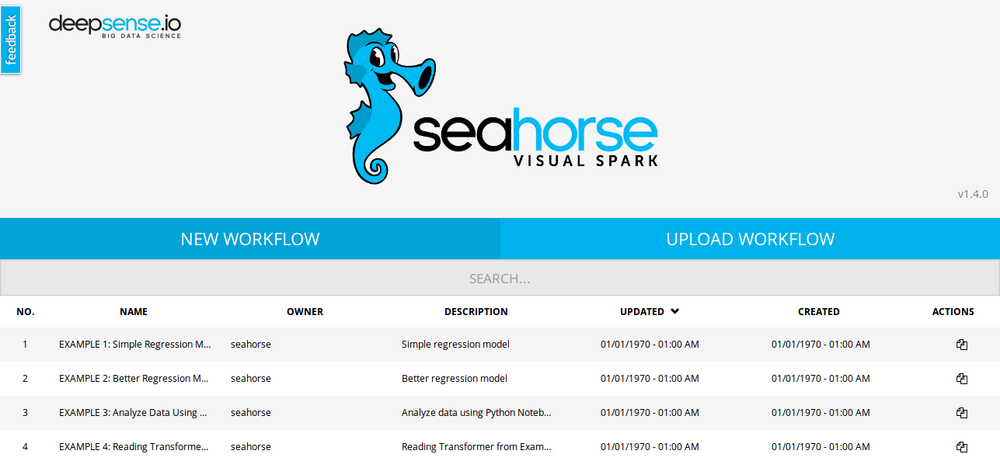
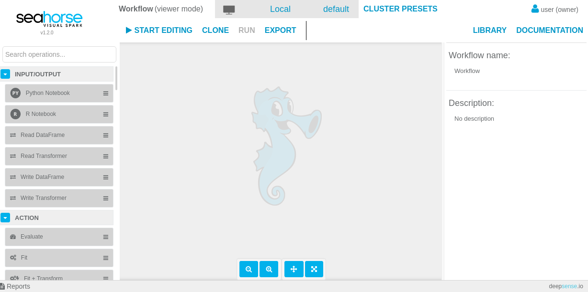
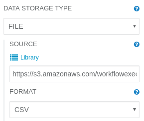
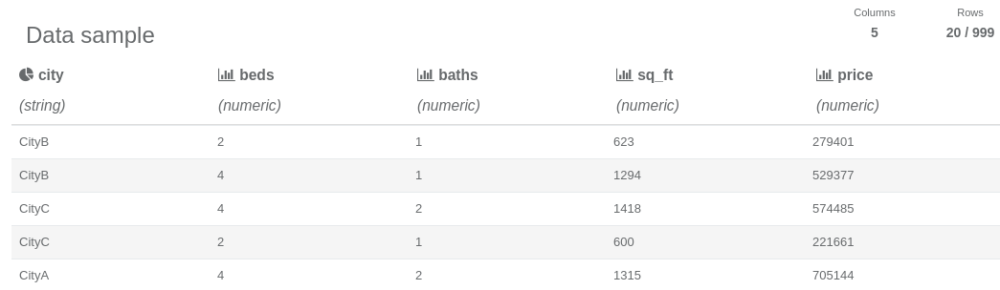
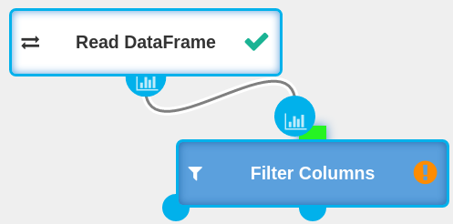
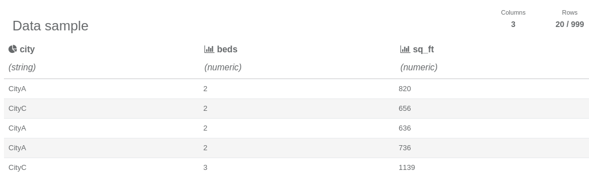

**Table of Contents**

* Table of Contents
{:toc}

## Quick Introduction

Seahorse is a data analytics platform letting users to create
<a target="_blank" href="https://spark.apache.org/">Apache Spark</a> applications in a intuitive and visual way.
All while connected to any Spark Cluster (YARN, Mesos, Standalone) or to a bundled local Spark.

For more detailed overview go to [Overview](./index.html).

## Run Seahorse on Your Machine

#### Mac or Windows

Seahorse for Mac

and Windows

is distributed in a form of Vagrant image.

1. Install **Vagrant (required)**. You can find the Vagrant installation guide at [vagrantup.com](https://www.vagrantup.com/docs/installation/).
2. Download `Vagrantfile` from [get Seahorse page](http://deepsense.io/get-seahorse/).
3. Go to the catalog with `Vagrantfile` file and run `vagrant up` from the command line.
4. Go to <a target="_blank" href="{{ site.SEAHORSE_EDITOR_ADDRESS }}">{{ site.SEAHORSE_EDITOR_ADDRESS }}</a> and start using Seahorse!

For more details and troubleshooting go to [Seahorse Standalone Deployment mode page](./deployment/standalone.html#seahorse-standalone-as-a-vagrant-image).

#### Linux

Seahorse for Linux

is distributed in a form of docker images.

1. Install **Docker (required)** and **docker-compose (required)**. You can find Docker installation guide at [docs.docker.com/engine](https://docs.docker.com/engine/installation/)
  and docker-compose installation guide at [docs.docker.com/compose](https://docs.docker.com/compose/install/).
2. Download `docker-compose.yml` from [get Seahorse page](http://deepsense.io/get-seahorse/).
3. Go to the catalog with `docker-compose.yml` file and run `docker-compose up` from the command line.
4. Go to <a target="_blank" href="{{ site.SEAHORSE_EDITOR_ADDRESS }}">{{ site.SEAHORSE_EDITOR_ADDRESS }}</a> and start using Seahorse!

For more details and troubleshooting go to [Seahorse Standalone Deployment mode page](./deployment/standalone.html#dockerized-seahorse-standalone).

## Use Seahorse

In the following steps we will read data.
Then we will apply simple transformation to the data.

#### Create New Workflow and Read Your Data

* Run Seahorse on your machine and go to <a target="_blank" href="{{ site.SEAHORSE_EDITOR_ADDRESS }}">{{ site.SEAHORSE_EDITOR_ADDRESS }}</a>.

    
    <em>Home Screen of Seahorse</em>

Home screen of Seahorse is a list of all workflows - initially filled with examples. For now let's create a new workflow.

* Create the new workflow using the **New Workflow** button. A Workflow Editor will get opened.

    
    <em>Workflow Editor</em>

* Start editing by clicking
  
  from the top menu. It will start up an Apache Spark backend for workflow.

* Read data with Seahorse!
  * Drag **Read Dataframe** from the left-hand side panel onto canvas.
  * Click on dragged **Read Dataframe** and change its parameters using the right-hand side panel.
    Set `source` parameter to
    <code>https://s3.amazonaws.com/workflowexecutor/examples/data/transactions.csv</code>

<!--Ten screen jest potrzebny, bo ikonka 'Library' wizualnie rozdziela labelke `SOURCE` i text input-->
<!--i nie wiadomo gdzie jest pole tekstowe opisane przez labelke 'Source'-->

* Run operation by clicking
  
  button from top menu.

Dataframe read by `Read Dataframe` operation is represented by

report icon. You can click it to preview data.

    
    <em>DataFrame Report opened after clicking report icon</em>

#### Transform Your Data

In the next step we will apply a simple transformation to our data.

* Drag `Filter Columns` operation onto canvas.
* Drag Dataframe produced by `Read Dataframe` operation to the `Filter Columns` operation.
* Set `selected column` parameter of `Filter Columns` to some columns of your choice.
* Run your workflow again and check transformed Dataframe produced by `Filter Columns`!

    
    <em>DataFrame Report with filtered columns</em>

Congratulations! You have successfully created your first Seahorse workflow.

## Learn More!

* Check out the [basic examples](./basic_examples.html) or [some of the more advanced use cases](./casestudies/income_predicting.html)
* Check out [a full operation list with a documentation](./operations.html).
