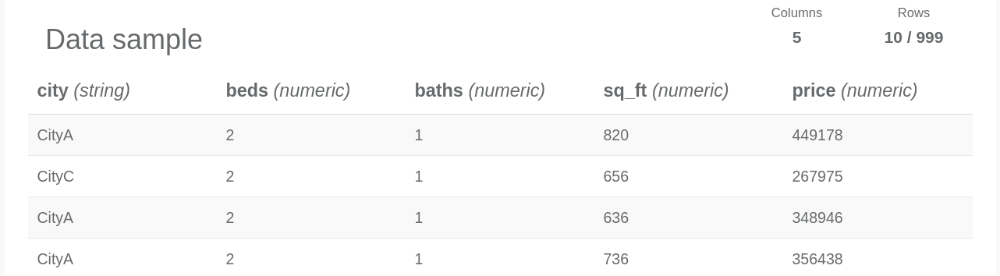
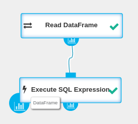
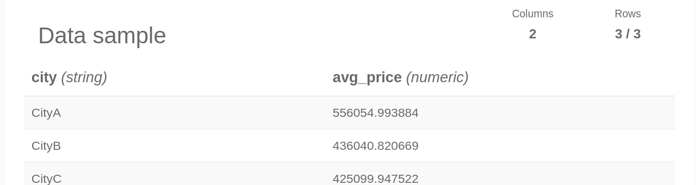

### Setup Seahorse

  [{: .centered-image .img-responsive}](http://10.10.1.77:8081/artifactory/seahorse-bundled-image/1451907274/Vagrantfile)
  _Requires <a target="_blank" href="http://download.virtualbox.org/virtualbox/5.0.10/">VirtualBox 5.0.10</a> and
  <a target="_blank" href="https://releases.hashicorp.com/vagrant/1.8.1/">Vagrant 1.8.1</a>_

* Run `vagrant up` from directory where `Vagrantfile` was downloaded. This may take a few minutes.
* After [Seahorse Bundled Image](bundled_image_overview.html) was installed, in
[Chrome browser](https://www.google.pl/chrome/browser/) go to locally hosted
<a target="_blank" href=" {{ site.SEAHORSE_EDITOR_ADDRESS }} ">Seahorse Editor</a>.

### Create a new empty workflow
In the the main page of Seahorse you can manage existing workflows and create new. Let's make a new one:

* Click **New workflow**.
* Name your workflow with `quickstart` so you can distinguish it later on.
* Press the **create** button.

### Build workflow
You've been redirected to workflow editor page where you can interactively compound complex algorithms.

In Seahorse, algorithms are represented as graphs of connected [operations](/operations.html),
which are consuming and producing [entities](/deeplang_overview.html#entities).

Let's start with a single one.

#### Read some data

* From left panel called **Operation catalogue**, drag [Read DataFrame](operations/read_dataframe.html) operation
  to your canvas.
* As you can see operation yields a warning. You can read it by moving cursor over exclamation mark.
* Click on **Read DataFrame** node on canvas to unfold parameters panel.
* Fill missing **SOURCE** with example data set
`https://s3.amazonaws.com/workflowexecutor/examples/data/transactions.csv`
* To make Seahorse fetch data, select dropped **Read DataFrame** and press **Run**.
Node will change its state to **RUNNING** and after a while to **COMPLETED**.
Execution time statistics are provided in the right panel.
* You can view sample data of any completed operation with [DataFrame](/classes/dataframe.html)
output by clicking its port icon.

#### Query it!
Loaded [transactions.csv file](https://s3.amazonaws.com/workflowexecutor/examples/data/transactions.csv)
contains apartments prices from 3 cities.
It has 5 columns and 1000 rows (header row and 999 data rows).
Each row provides information about the apartment:
city, number of bedrooms, number of bathrooms, size of the apartment (in square feets) and its price.

Let's calculate average apartment price for each city:

* From **Operation catalogue**, drag [Execute SQL Expression](operations/execute_sql_expression.html) operation
  to your canvas.
* Drag **Read DataFrame** output to **Execute SQL Expression** input to make a connection.
* Select **Execute SQL Expression** operation.
* Fill its parameters:
  * Set **DATAFRAME ID** to `transactions`. You will refer in SQL expression to the DataFrame by this name.
  * Set **EXPRESSION** to `SELECT city, AVG(price) as avg_price FROM transactions GROUP BY city`
* Click run to execute workflow and you will see two completed nodes.
* To view results, click on the first output port of **Execute SQL Expression**.

Congratulations! You have successfully made your first Seahorse application.

Please visit [more examples](examples.html) that cover: Data Processing, Machine Learning and Custom Seahorse Operations.
