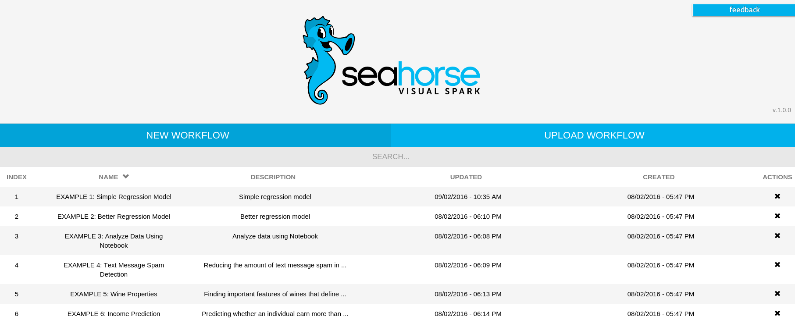
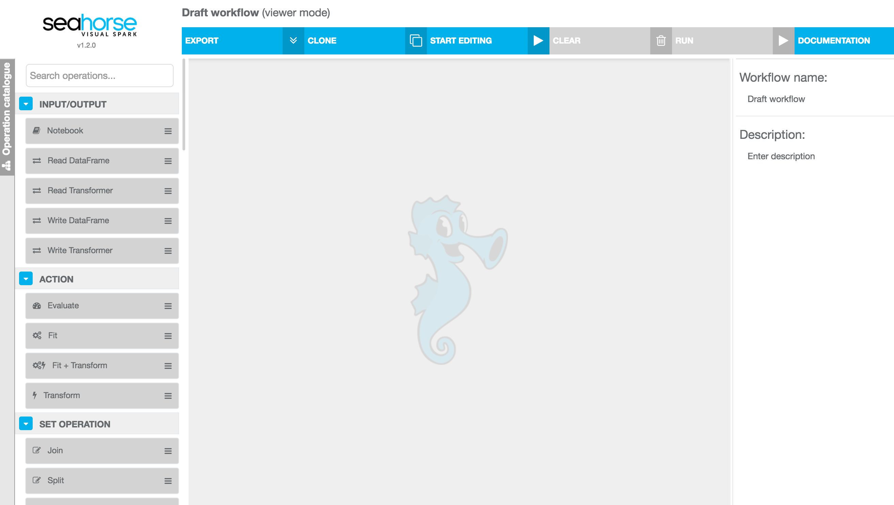
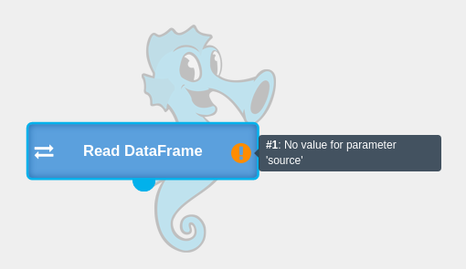
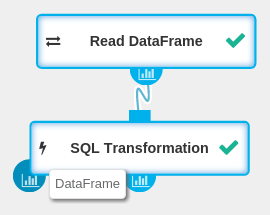

**Table of Contents**

* Table of Contents
{:toc}

## Setup

Follow the instructions at the [Try Seahorse](../downloads.html) page to start your Seahorse instance.

## Test It
Depending on the deployment mode you are using (they are all listed [here](../downloads.html))
Seahorse might be available at different addresses. In Seahorse Desktop it's usually
<a target="_blank" href="{{ site.SEAHORSE_EDITOR_ADDRESS }}">{{ site.SEAHORSE_EDITOR_ADDRESS }}</a> (visit [Seahorse Desktop Overview](../desktop_overview.html) for details).
Open it in your browser and you will see the web-based user interface:

    
    <em>Home Screen of Seahorse</em>

On the main page of Seahorse you can see a list of all available projects which we call `workflows`.
Initially, the list contains a set of examples included in order to give you a sense of what is possible in Seahorse.
You can examine the examples to learn how to solve common data-related problems.
From the main page you can also create a new empty workflow or upload the previously exported workflow.

### Create a New Workflow

To create a new workflow:

* Click **New Workflow** from the menu.
* Name your workflow and add a description.
* Press the **Create** button.

You have been redirected to workflow editor where you can create your application in a visual way.

Click the **START EDITING** button in the top panel to start editing the workflow.

    
    <em>Empty canvas of Seahorse workflow editor</em>

In Seahorse, an application is represented as a graph of connected [operations](../operations.html).
Operations represent various stages of data processing - from data ingestion and clean-up,
through a broad range of transformations, up to predictive modelling and reporting.

#### Read Data

First thing that we want to do in our quick start example is to read some data.

* From the left panel called the **Operation Catalogue**, drag a [Read DataFrame](../operations/read_dataframe.html) operation
  onto your canvas.
* As you can see, the operation yields a warning. You can read it by moving the cursor over the exclamation mark.
* Click on the `Read DataFrame` node on the canvas to unfold the parameters panel.
* Fill in the missing value for the `SOURCE` parameter with a path to the example dataset:
`https://s3.amazonaws.com/workflowexecutor/examples/data/transactions.csv`
* Press **RUN**. The node will change its state to **RUNNING** and after a while to **COMPLETED**.
Execution time statistics are provided in the right panel.
* You can see reports for every executed operation by clicking on output ports (little blue icons on the bottom edge of operation nodes) of the operation.
For the `Read DataFrame` the report contains a data sample of the read [DataFrame](../classes/dataframe.html).

#### Query It!
Loaded <a target="_blank" href="https://s3.amazonaws.com/workflowexecutor/examples/data/transactions.csv">transactions.csv</a>
file contains apartment prices from 3 cities.
It has 5 columns and 1000 rows (header row and 999 data rows).
Each row provides information about the apartment:
city, number of bedrooms, number of bathrooms, size of the apartment (in square feet) and its price.

Let's calculate the average apartment price for each city:

* From the **Operation Catalogue**, drag a [SQL Transformation](../operations/sql_transformation.html)
operation onto your canvas.
* Drag the `Read DataFrame` output to the `SQL Transformation` input to make a connection.
* Fill the `SQL Transformation` operation's parameters:
  * Set `DATAFRAME ID` to `transactions`. In SQL expression you will refer to the DataFrame by this name.
  * Set `EXPRESSION` to `SELECT city, AVG(price) as avg_price FROM transactions GROUP BY city`
* Click **RUN** to execute this workflow and you will see two completed nodes.
* To view results by clicking on the first output port of the `SQL Transformation`.

Congratulations! You have successfully created your first Seahorse application.

