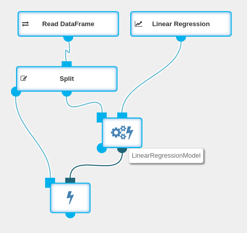

The `Fit + Transform` operation is a combination of [Fit](../operations/fit.html) and
[Transform](../operations/transform.html).
It is used to fit an [Estimator](../classes/estimator.html) on a
[DataFrame](../classes/dataframe.html). It produces a [Transformer](../classes/transformer.html)
and a transformed `DataFrame`.

**Usage example**:
{: .img-responsive .spacer .centered-image}

**Since**: Seahorse 1.0.0

## Input

<table>
<thead>
<tr>
<th style="width:15%">Port</th>
<th style="width:15%">Type Qualifier</th>
<th style="width:70%">Description</th>
</tr>
</thead>
<tbody>
<tr>
<td><code>0</code></td>
<td><code><a href="../classes/dataframe.html">DataFrame</a></code></td>
<td>The <code>DataFrame</code> to fit the <code>Estimator</code> on.</td>
</tr>
<tr>
<td><code>1</code></td>
<td><code><a href="../classes/estimator.html">Estimator</a></code></td>
<td>The <code>Estimator</code> to fit.</td>
</tr>
</tbody>
</table>

## Output

<table>
<thead>
<tr>
<th style="width:15%">Port</th>
<th style="width:15%">Type Qualifier</th>
<th style="width:70%">Description</th>
</tr>
</thead>
<tbody>
<tr>
<td><code>0</code></td>
<td><code><a href="../classes/dataframe.html">DataFrame</a></code></td>
<td>The <code>DataFrame</code> which is a result of the <code>Transformer</code> executed on the input <code>DataFrame</code>.</td>
</tr>
<tr>
<td><code>1</code></td>
<td><code><a href="../classes/transformer.html">Transformer</a></code></td>
<td>The result of fitting the <code>Estimator</code> on the input <code>DataFrame</code>.</td>
</tr>
</tbody>
</table>
