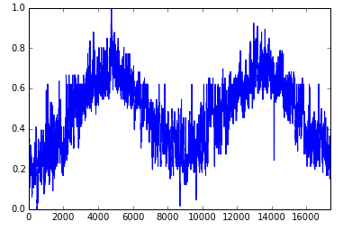

Notebook is a special type of operation. It gives user capability to quickly explore data.
In the notebook user can write code using Spark Python API.
Blocks of python code can be executed and results are immediately returned to the notebook.

To use the notebook user has to drag and drop Notebook operation into the canvas and connect a DataFrame to the input port.
Notebook operation has to be executed using partial execution before running any code in the notebook.
As a result required input DataFrame will be calculated and registered in the notebook.

User can start editing code by selecting option in the Notebook operation's parameters panel.

Variables and functions available in the notebooks' global scope:

* <code>dataframe()</code> - function that returns input DataFrame for this notebook.

* <code>sc</code> - Spark Context

* <code>sqlContext</code> - SQL Context

To visualize data user can use <a target="_blank" href="{{ site.PANDAS_LIBRARY_ADDRESS }}">pandas</a> library.

**Since**: Seahorse 1.0.0

####Examples


from pyspark.sql.types import *
from pyspark.sql import SQLContext, Row

schemaString = "datetime,weather2,weather3,windspeed,hum,temp,atemp"
fields = [StructField(field_name, StringType(), True) for field_name in schemaString.split(",")]
schema = StructType(fields)

lines = sc.textFile("weather.csv")
split = lines.map(lambda s: s.split(","))
df = sqlContext.createDataFrame(split, schema)
df.show()


    +--------------------+--------+--------+---------+----+----+------+
    |            datetime|weather2|weather3|windspeed| hum|temp| atemp|
    +--------------------+--------+--------+---------+----+----+------+
    |2011-01-01T00:00:...|       0|       0|        0|0.81|0.24|0.2879|
    |2011-01-01T01:00:...|       0|       0|        0| 0.8|0.22|0.2727|
    |2011-01-01T02:00:...|       0|       0|        0| 0.8|0.22|0.2727|
    |2011-01-01T03:00:...|       0|       0|        0|0.75|0.24|0.2879|
    |2011-01-01T04:00:...|       0|       0|        0|0.75|0.24|0.2879|
    |2011-01-01T05:00:...|       1|       0|   0.0896|0.75|0.24|0.2576|
    |2011-01-01T06:00:...|       0|       0|        0| 0.8|0.22|0.2727|
    |2011-01-01T07:00:...|       0|       0|        0|0.86| 0.2|0.2576|
    |2011-01-01T08:00:...|       0|       0|        0|0.75|0.24|0.2879|
    |2011-01-01T09:00:...|       0|       0|        0|0.76|0.32|0.3485|
    |2011-01-01T10:00:...|       0|       0|   0.2537|0.76|0.38|0.3939|
    |2011-01-01T11:00:...|       0|       0|   0.2836|0.81|0.36|0.3333|
    |2011-01-01T12:00:...|       0|       0|   0.2836|0.77|0.42|0.4242|
    |2011-01-01T13:00:...|       1|       0|   0.2985|0.72|0.46|0.4545|
    |2011-01-01T14:00:...|       1|       0|   0.2836|0.72|0.46|0.4545|
    |2011-01-01T15:00:...|       1|       0|   0.2985|0.77|0.44|0.4394|
    |2011-01-01T16:00:...|       1|       0|   0.2985|0.82|0.42|0.4242|
    |2011-01-01T17:00:...|       1|       0|   0.2836|0.82|0.44|0.4394|
    |2011-01-01T18:00:...|       0|       1|   0.2537|0.88|0.42|0.4242|
    |2011-01-01T19:00:...|       0|       1|   0.2537|0.88|0.42|0.4242|
    +--------------------+--------+--------+---------+----+----+------+


import matplotlib.pyplot as plt
%matplotlib inline
df = dataframe().toPandas()
df['atemp'].plot()


## Input

<table>
<thead>
<tr>
<th style="width:15%">Port</th>
<th style="width:15%">Type Qualifier</th>
<th style="width:70%">Description</th>
</tr>
</thead>
<tbody>
<tr>
<td><code>0</code></td>
<td><code><a href="../classes/dataframe.html">DataFrame</a></code></td>
<td>DataFrame that can be used in Notebook operation.</td>
</tr>
</tbody>
</table>

## Output

Notebook operation does not produce any output.
