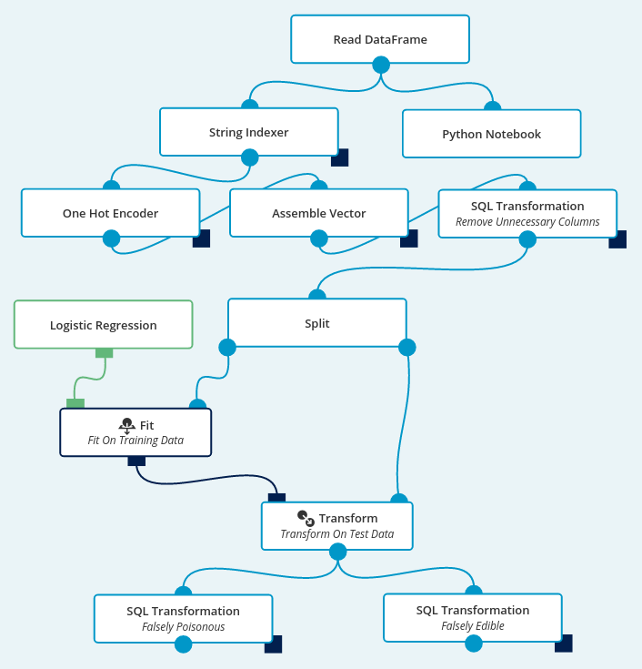
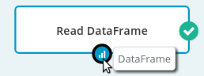
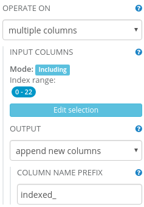
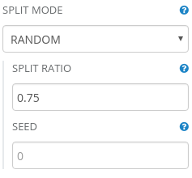
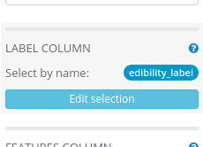
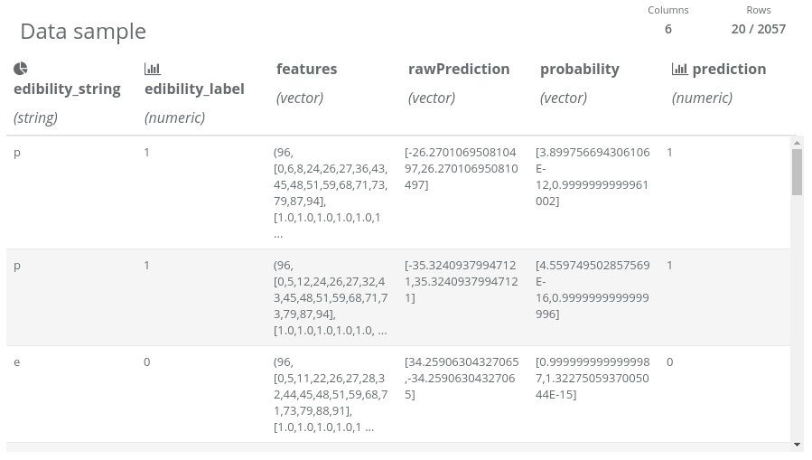

  

    <h2 style="margin-top: 0; padding-top: 0">Basic Information</h2>
    

      <b>Dataset</b>: <a target="_blank" href="http://archive.ics.uci.edu/ml/datasets/Mushroom">Mushroom Data Set</a>
    

    

      <b>Dataset size</b>: 8124 instances (4208 edible and 3916 poisonous);
      22 features (phenotypic traits codes, e.g. cap color, odor, veil type, habitat) and 1 label column (edible or poisonous).
    

    

      <b>Dataset description</b>:
      This data set includes descriptions of hypothetical samples corresponding to 23 species of gilled mushrooms in the Agaricus and Lepiota Family.
    

    

      <b>Business purpose</b>:
      Distinguishing poisonous and edible mushrooms.
      Classification model created during this experiment could aid experts in classifying mushroom specimens as poisonous or edible.
    

    

      <b>Data set credits</b>:
      Lichman, M. (2013). UCI Machine Learning Repository
      <a target="_blank" href="http://archive.ics.uci.edu/ml">http://archive.ics.uci.edu/ml</a>.
      Irvine, CA: University of California, School of Information and Computer Science.
    

  

  <h2 style="margin-top: 0; padding-top: 0">Workflow Overview</h2>
  

    
  

  

    This is a complete experiment that generates a mushroom classification model.
    The workflow file is included in Seahorse,
    but we will also show you how to create that experiment step-by-step.
  

## Step-by-step Workflow Creation

### Reading Data

The data is provided in a form of a 23-column, comma-separated CSV-like file with column names in the first line.
To work with the dataset, it has to be loaded into Seahorse. This can be done by a
[Read DataFrame](../operations/read_dataframe.html) operation.
Let’s place it on the canvas using drag-and-drop from the operations palette.
To load the data, we need to create a Data Source corresponding to the file.
**SOURCE**: <a target="_blank" href="https://s3.amazonaws.com/workflowexecutor/examples/data/mushrooms.csv">https://s3.amazonaws.com/workflowexecutor/examples/data/mushrooms.csv</a>

After preparing Data Source for Read DataFrame, the operation is ready to be executed
 -– simply click the RUN button in the top Seahorse toolbar.
If you have much more operations on the canvas and you are interested in the results of only one operation,
you can use partial execution of the workflow. Simply select that operation before clicking RUN.
When the execution ends, a report of the operation will be available.
Let’s click on the operation output port to see its result.

At the bottom of the screen you will see a simple DataFrame report.
It contains information about data loaded by the Read DataFrame operation.

The DataFrame is too wide (more than 20 columns) to allow viewing the data sample in the report,
so we are able to explore here only the column types and names.
If you want to explore the data a bit more, you can use
a [Python Notebook](../operations/python_notebook.html) operation
(it allows interactive data exploration). Just place it on the canvas (use drag-and-drop technique)
and connect its input port with the Read DataFrame output port
(click on the output port and drag it to an input port of the other operation).
Now, you can open the Python Notebook by selecting it on the canvas and clicking at the “Open notebook” button on the right panel.

In the newly opened window, enter: `dataframe().take(10)` and click on the “run cell” button
(you can use a shortcut for it: Ctrl+Enter).
Now you can closely investigate the data sample of the first 10 rows returned
by the Read DataFrame operation.

### Data Transformation

In the first column we have labels stating to which class a specific sample belongs (possible values: `edible` or `poisonous`).
We have discovered that all columns have string values.
To perform classification, Seahorse needs a numeric label column and a vector of numerics as features column.
We need to map string values to numbers and assembly features into a single vector column.
This can be done by combining multiple operations
 – [String Indexer](../operations/string_indexer.html)
with [One Hot Encoder](../operations/one_hot_encoder.html)
and [Assemble Vector](../operations/assemble_vector.html)
 – as shown in the workflow overview image.

The String Indexer operation translates string values to numeric ordinal values.
It needs to have its parameters modified, as follows:

**OPERATE ON**: multiple columns

**INPUT COLUMNS**: Including index range 0-22 (all columns)

**OUTPUT**: append new columns

**COLUMN NAME PREFIX**: indexed_

The One Hot Encoder operation translates ordinal values to vector having “1” only at position given by input numeric value.
It needs to have its parameters modified, as follows:

**OPERATE ON**: multiple columns

**INPUT COLUMNS**: Including index range 24-38 and 40-45

*We have to exclude the column at index 39 (indexed_veil-type) because all mushroom specimens had
<a target="_blank" href="https://en.wikipedia.org/wiki/Partial_veil">partial veil</a>.
One Hot Encoder does not allow operating on columns with only one value
(unless user wants to drop the last category using DROP LAST parameter).*

Assemble Vector merges columns with numerics and vectors of numerics into a single vector of numerics. It needs to have its parameters modified, as follows:

**INPUT COLUMNS**: Including index range 24-45 (columns generated by the String Indexer, excluding generated column containing edibility label)

**OUTPUT COLUMN**: features

### Remove Unnecessary Columns

We will use the
[SQL Transformation](../operations/sql_transformation.html)
operation to remove unnecessary columns from the dataset and give more meaningful names to columns
that are essential for our experiment.
It will make the dataset reports smaller and facilitate exploring data.

SQL Transformation needs to have its parameter modified, as follows:

**EXPRESSION**:


SELECT
    edible AS edibility_string,
    indexed_edible AS edibility_label,
    features
FROM df


### Splitting Into Training and Test Set

To perform a fair evaluation of our model, we need to split our data into two parts:
a testing dataset and a training dataset. That task could be accomplished by using
a [Split](../operations/split.html) operation.
To divide the dataset in ratio 1 to 3, we do need to modify its default parameters:

**SPLIT RATIO**: 0.75
*(percentage of rows that should end up in the first output DataFrame – the training set)*

### Model Training

To train a model, we need to use
the [Fit](../operations/fit.html) operation,
which can be used to fit
an [Estimator](../classes/estimator.html).
We want to use logistic regression classification, so we will put
the [Logistic Regression](../operations/logistic_regression.html)
operation on the canvas and connect it to the Fit operation.

We will leave almost all default values of Logistic Regression parameters unchanged,
we need only to change the label column to edibility_label.

**LABEL COLUMN**: edibility_label

### Verifying Model Effectiveness On Test Data

By using Split operation, we had generated a training dataset and a test dataset from the input data.
We have trained our model on the training dataset.
Now it is time to use the test dataset to verify the effectiveness of our classification model.
To generate predictions using the trained model, we need to use
a [Transform](../operations/transform.html) operation.
To assess effectiveness of our model we will count “Falsely Poisonous” (waste of edible mushrooms)
and “Falsely Edible“ (very dangerous!) entries in the test dataset. To perform the calculations,
we will use the SQL Transformation operation.

After executing the Transform operation, we can investigate the resulting report:

Thanks to projecting only the necessary columns, the resulting dataset fits in the column number limit
and we are able to view the data sample. We can notice that the test dataset has 2057 entries.
Also we can see that the String Indexer operation assigned 0 to “e” label (edible class) and 1 to “p” label (poisonous class).
We can also notice that the prediction column has “almost the same” values as “edibility” column,
so we can suspect that our model performs well. Let’s measure its performance:

The SQL Transformation (Falsely Edible) needs to have its parameter modified, as follows:

**EXPRESSION**:

SELECT * FROM df WHERE prediction=0 AND edibility_label=1

The SQL Transformation (Falsely Poisonous) needs to have its parameter modified, as follows:

**EXPRESSION**:

SELECT * FROM df WHERE prediction=1 AND edibility_label=0

Now we can explore reports in these two operations and compare the number of rows in each of them:

**Falsely Poisonous**: 0

**Falsely Edible**: 0

### Conclusion

It means that we have trained a surprisingly accurate prediction model for classifying mushrooms.
We have to remember that some dangers remain such as:

<ol>
  <li>Mushroom picker examining the specimen can make a mistake during assessment of traits or entering data to the computer.</li>
  <li>Data sample might be too small to create a comprehensive model for predicting edibility of all mushrooms that users will want to classify.</li>
  <li>Two different mushroom species can have identical traits, while one of the species is edible and the second one is poisonous.</li>
</ol>

Due to those problems, we can use this model only to **aid expertise** on mushroom edibility.
Experts should always have the last word over issues that are potentially dangerous for other people,
like classifying poisonous mushrooms.
This must be followed not only due to lack of confidence for the newly created prediction model
(experts can make mistakes even more often than this model),
but most of all – due to legal responsibility of those decisions.
