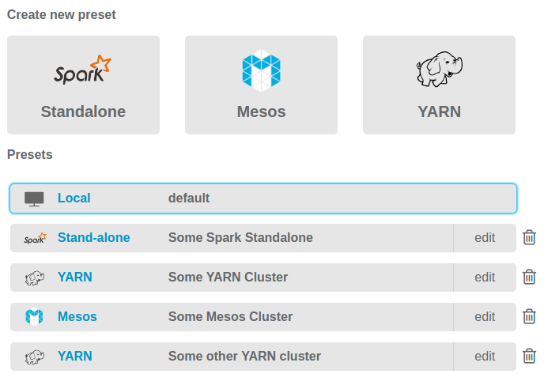

## Overview

Seahorse comes bundled with a local, single-node Spark cluster to allow you to get started quickly.
To assess its full potential, however, configure Seahorse to utilize external clusters.

In order to connect to a cluster, the machine with Seahorse must be addressable from every node of the cluster.
This is because Seahorse runs applications in client mode - your machine runs Spark driver.

In Seahorse Editor, you can specify all options needed to connect to your cluster.
Aside from the `Spark Master URL`, probably the most important option is the `User IP`.
It has to be set to such an IP of the machine with Seahorse that is visible from the cluster.

Conveniently, Seahorse allows you to store configurations for various clusters.

  {: .centered-image .img-responsive .bordered-image}
  *Cluster Presets in Seahorse*

## External Clusters with Seahorse as a Vagrant Image

While working with external clusters is straight-forward when running
[Dockerized Seahorse](../deployment.html#dockerized-seahorse),
it's also possible using [Seahorse as a Vagrant Image](../deployment.html#seahorse-as-a-vagrant-image).
There is a commented line in the `Vagrantfile`.
It needs to be uncommented in order for the VM to receive its own IP address, that is visible from
the Spark cluster.


 ...
 # Uncomment this line if you want this VM to connect directly to your network.
 # Visit http://seahorse.deepsense.ai for details.
 config.vm.network "public_network", use_dhcp_assigned_default_route: true
 ...


After the `vagrant up` command you are asked which network interface should be used to obtain
the new IP address. You should select the interface which you normally use to connect to the cluster.
Note that this method will not work if the network configuration prevents bridge
networking - you should contact your admins if this is the case.

Furthermore, it's important to remember that the `User IP` option in the cluster configuration
should be set to the VM's IP.
You can obtain it by accessing the VM with `vagrant ssh` and using the `ifconfig` command.

For more details on Vagrant configuration, take a look at
[Vagrant documentation](https://www.vagrantup.com/docs/networking/public_network.html).

## Troubleshooting

In case of any problems with connecting to external cluster, it is helpful to read error logs
produced by the Spark application. Go to your Seahorse startup directory
(where you keep either `docker-compose.yml` or `Vagrantfile`).
The relevant logs can be found in `spark_applications_logs` directory.
