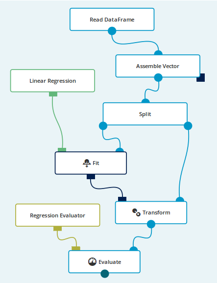
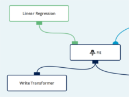
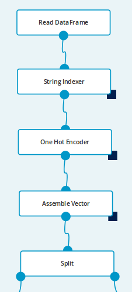
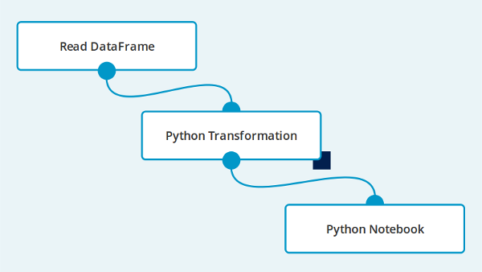

This set of basic examples will introduce you to some of the fundamental Seahorse features.

### Example 1 - Build a Simple Regression Model

The goal of this exercise is to build a model predicting apartment prices based on 3 features:
**beds**, **baths** and **sq_ft**.

The dataset <a target="_blank" href="https://s3.amazonaws.com/workflowexecutor/examples/data/transactions.csv">transactions.csv</a> has 5 columns and 1,000 rows
(header row and 999 data rows).
Each row provides information about the apartment:
city, number of bedrooms, number of bathrooms, size of the apartment (in square feet) and its price.

    city,beds,baths,sq_ft,price
    CityB,4,1,1294,529377
    CityC,4,2,1418,574485
    CityC,2,1,600,221661
    ...

To build the model we will split our initial dataset
into two parts - training and validation sets. We will train a
linear regression model using training set.
The model will be scored (against the validation part of the dataset) and report of
the scoring will be produced (model performance report).

#### Create a New Workflow

1. Create an empty workflow:
   * Go to Seahorse main page and click **New workflow**.
   * Put <code>machinelearning1</code> in the **Name** section - setting a meaningful name will help
     when looking for a workflow in the workflow list.
   * Press the **Create** button.
   * Start editing the workflow.

1. Set the source of your data:
   * Right-click on the canvas and select a [Read DataFrame](operations/read_dataframe.html) operation.
   * Click on the created `Read DataFrame` operation - the panel on the right now shows its parameters.
   * Select a data source from which you want to read the data. In this case, pick `transactions.csv`.
     Once the operation gets executed, the dataset will be downloaded from a web address.

    

        
        <em>The Simple Regression Model</em>
    

1. Select features that will be used to train and evaluate model and create a vector column
   containing selected features' values:
   * Drag an edge from the output port of the `Read DataFrame`.
     Select an [Assemble Vector](operations/assemble_vector.html) operation.
   * In the **INPUT COLUMNS** section:
     * Click **Edit selection**, this will open the selection window for the `INPUT COLUMNS` parameter.
     * Select **Excluding** mode in the top-right corner - this will include all values
         except the ones selected in the features column.
     * Add <code>city</code> and <code>price</code> to the list - we have to exclude the <code>city</code>
       column, because it does not contain numeric values and <code>price</code>, because it contains
       the actual results.
   * Put <code>features</code> in the `OUTPUT COLUMN` parameter - the operation will add a column
     with this name to the dataset.

1. Split the dataset into training and test sets:
   * Drag an edge from the middle port of the `Assemble Vector`. Select a [Split](operations/split.html) operation.
   * Put <code>0.7</code> in the `SPLIT RATIO` parameter - we will use 30% of the data for
     training and 70% for evaluation.
   * Put <code>0</code> in the `SEED` parameter - the split operation itself is not deterministic.
     You can put any value here - it will split the dataset differently, but in the same proportions.

1. Use the linear regression algorithm:
   * Right-click on the canvas and select [Linear Regression](operations/linear_regression.html) operation.
   * In the **FEATURES COLUMN** section:
     * Click **Edit selection**, this will open the selection window for the `FEATURES COLUMN` parameter.
     * Click at **Select by name** and put <code>features</code> in the text field - this will use
       the column created in step 3.
   * In the `PREDICTION COLUMN` section put <code>prediction</code> - this new column will contain
     predicted values.
   * In the **LABEL COLUMN** section:
     * Click **Edit selection** - this will open a selection window for the `LABEL COLUMN` parameter.
     * Click at **Select by name** and put <code>price</code> in the text field - **price**
       column contains the actual values that we will evaluate our model against.

1. Drag an edge from the output port of the `Linear Regression` and select a [Fit](operations/fit.html) operation.
   This operation will be used to fit model to the training set.

1. Drag an edge from the output port of the `Fit` and select a [Transform](operations/transform.html) operation.
   It will transform the dataset using the model fitted in the previous step.

1. Select evaluation method:
   * Right-click on the canvas and select a [Regression Evaluator](operations/regression_evaluator.html) operation.
     * This operation will create an evaluator for regression algorithms, we will use the default
       evaluation metric (RMSE).
     * Put <code>prediction</code> in the `PREDICTION COLUMN` parameter.
     * Put <code>price</code> in the `LABEL COLUMN` parameter.
     * The evaluator will measure the error between **price** and **prediction** columns.
   * Drag an edge from the output port of the `Regression Evaluator` and select
     an [Evaluate](operations/evaluate.html) operation.
   * Connect the output port of the `Transform` with the input port of the `Evaluate`.

#### Execute the Workflow
{:.no_toc}

* Click on the `Evaluate` node.
  This will mark the node to be executed. All required predecessor nodes will be executed as well.
* Press **RUN** button from the top menu.
  This operation will execute the workflow and may take some time. During the execution you can see
  the progress by observing icons on operation nodes. The operation being executed will have a
  spinning wheel on the right side. Completed operations are marked with green ticks. The workflow
  execution will be finished when the selected Evaluate node's execution is completed.

#### View the Reports
{:.no_toc}

Click on the report icon under the `Evaluate` node. Report panel with evaluation metric
will be shown at the bottom of the screen. This metric is showing our model's performance.
In the next example we will try to improve it.

#### Export the Model

Model training might take a lot of time. It is possible to export trained
models for further reuse with `Write Transformer` operation.
An exported model can also be shared with other users.

1.  Right-click on the canvas and select a `Write Transformer` operation.
1.  Set **OUTPUT PATH** parameter's value to `/resources/data/model_example_1`.
1.  Drag the `Fit` output to the `Write Transformer` operation.
1.  Click **RUN** to execute the workflow again. It will write the transformer to the specified path.

### Example 2 - Build a Better Model

The goal of this exercise is to improve our previous model's performance.
In the previous example we only used 3 features of the apartments:
**beds**, **baths** and **sq_ft**.
We will now add the **city** feature to the model.

In our dataset **city** is a text column,
and [Linear Regression](operations/linear_regression.html)
algorithm only works on numerical columns.
A quick glance on the **city** column's values suggests that it might be a categorical column - a column
containing only a small, fixed set of different values. We will process this feature before
executing linear regression algorithm on the data.

#### Update the Workflow

    
    <em>The Updated Workflow</em>

1. Open workflow from **Example 1**.

2. Disconnect the `Assemble Vector` node from the `Read DataFrame` node:
   * Grab the connection going into the input port of the `Assemble Vector` node and drag it
     anywhere on the empty space of the canvas.

3. Convert **city** feature to categorical:
   * Drag an edge from the output port of the `Read DataFrame` and select
     a [String Indexer](operations/string_indexer.html) operation.
     * This operation will create a new column, <code>city_index</code>, with numbers representing
       text values from the original column.
     * Select <code>one column</code> in `OPERATE ON` selector.
     * Select <code>city</code> in the `INPUT COLUMN`.
     * Select <code>append new column</code> in `OUTPUT` selector.
     * Put <code>city_index</code> in the `OUTPUT COLUMN`.
   * Drag an edge from the output port of the `String Indexer` and select
     an [One Hot Encoder](operations/one_hot_encoder.html) operation.
     * This operation will create separate columns for each value from the original column.
     * Select <code>one column</code> in `OPERATE ON` selector.
     * Select <code>city_index</code> in the `INPUT COLUMN`.
     * Select <code>append new column</code> in `OUTPUT` selector.
     * Put <code>city_encoded</code> in the `OUTPUT COLUMN`.
   * Connect the output port of the `One Hot Encoder` with the input port of the `Assemble Vector`.
   * Modify existing `Assemble Vector` node and add <code>city_index</code> to excluded columns:
     * In the **INPUT COLUMNS** section click **Edit selection**.
     * Add <code>city_index</code> to the list - we only want to add <code>city_encoded</code>
       column to the features.
   * As a result of executing the operations above, our dataset will contain additional
     columns with values <code>0</code> or <code>1</code> for each possible value of the <code>city</code>
     column.

#### Execute the Workflow
{:.no_toc}

* Click on the `Evaluate` node.
* Press **RUN** button from the top menu.

#### View the Reports
{:.no_toc}

Click on the report icon under the `Evaluate` node. As you can see the model performance is much
better than in the previous example.

### Example 3 - Analyze the Data Using a Python Notebook

The goal of this exercise is to show how to use an embedded [Python Notebook](operations/python_notebook.html)
to interactively analyze data.

    
    <em>Analyze the Data Using a Python Notebook</em>

#### Create a New Workflow

* Create an empty workflow:
  * Go to Seahorse main page and click **New workflow**.
  * Put <code>notebook1</code> in the **Name** section.
  * Press the **Create** button.
  * Start editing the workflow.

* Set the source of your data:
  * Right-click on canvas and select a [Read DataFrame](operations/read_dataframe.html) operation.
  * In the `Read DataFrame` parameters, pick the `grades_2.0.csv` data source.

* Process the dataset before opening the notebook:
  * Drag an edge from the output port of the `Read DataFrame` and select
    a [Python Transformation](operations/python_transformation.html) operation.
  * Put the following code in the `CODE` parameter, in order to extract the <code>FCE</code> value
    from <code>Certificates</code> column to a separate column:


import json
from pyspark.sql.types import *

def transform(dataframe):
    def get_fce(js):
        return float(json.loads(js)['Cambridge']['FCE'])

    sqlContext.registerFunction(
      "get_fce", get_fce, FloatType())
    sqlContext.registerDataFrameAsTable(dataframe, "df")
    return sqlContext.sql(
      "SELECT Math, English, get_fce(Certificates) as FCE FROM df")


This snippet of code uses a user-defined SQL function that
utilizes Python’s json library in order to parse our `Certificates` column.

* Drag an edge from the middle output port of the `Python Transformation`
  and select a [Python Notebook](operations/python_notebook.html).

#### Execute and Edit the Python Notebook

* Select the created `Python Notebook` node.
* Press **RUN** button from the top menu.
* Click **Open notebook** in the right panel. A notebook window will be shown, where you can write
  Python code snippets, execute them and see the execution results.

##### Use the Spark Context
{:.no_toc}

The Spark Context is available in the `Python Notebook` as a global variable `sc`.

<table>
<tr>
<td><b>In:</b></td>
<td>

sc.parallelize([1,2,3,4,5]).map(lambda x: x*x).collect()

</td>
</tr>

<tr>
<td><b>Out:</b></td>
<td>
[1, 4, 9, 16, 25]
</td>
</tr>
</table>

##### Use the SQLContext
{:.no_toc}

SQLContext can be accessed as a global variable `sqlContext`.

<table>
<tr>
<td><b>In:</b></td>
<td>

sqlContext.registerDataFrameAsTable(dataframe(), "notebook_df")
sqlContext.sql("SELECT FCE FROM notebook_df").toPandas().sample(5)

</td>
</tr>

<tr>
<td><b>Out:</b></td>
<td>

<table border="1" class="dataframe">
  <thead>
    <tr style="text-align: right;">
      <th></th>
      <th>FCE</th>
    </tr>
  </thead>
  <tbody>
    <tr>
      <th>143</th>
      <td>54.563766</td>
    </tr>
    <tr>
      <th>169</th>
      <td>77.494507</td>
    </tr>
    <tr>
      <th>183</th>
      <td>70.320213</td>
    </tr>
    <tr>
      <th>64</th>
      <td>53.837051</td>
    </tr>
    <tr>
      <th>663</th>
      <td>66.830711</td>
    </tr>
  </tbody>
</table>

</td>
</tr>
</table>

##### Perform Operations on the Input DataFrame
{:.no_toc}

You can access the `DataFrame` passed to the `Python Notebook` node on the first input port by calling the
`dataframe()` function.

<table>
<tr>
<td><b>In:</b></td>
<td>

dataframe().toPandas().sample(5)

</td>
</tr>

<tr>
<td><b>Out:</b></td>
<td>

<table border="1" class="dataframe">
  <thead>
    <tr style="text-align: right;">
      <th></th>
      <th>Math</th>
      <th>English</th>
      <th>FCE</th>
    </tr>
  </thead>
  <tbody>
    <tr>
      <th>758</th>
      <td>48.541864</td>
      <td>67.253461</td>
      <td>50.007278</td>
    </tr>
    <tr>
      <th>224</th>
      <td>48.970637</td>
      <td>60.484968</td>
      <td>78.093758</td>
    </tr>
    <tr>
      <th>232</th>
      <td>37.470484</td>
      <td>76.686701</td>
      <td>58.276207</td>
    </tr>
    <tr>
      <th>449</th>
      <td>55.859676</td>
      <td>64.828651</td>
      <td>75.111809</td>
    </tr>
    <tr>
      <th>970</th>
      <td>31.342785</td>
      <td>72.106684</td>
      <td>70.328934</td>
    </tr>
  </tbody>
</table>

</td>
</tr>
</table>

##### Visualize Data Using Pandas and Matplotlib
{:.no_toc}

You can use Matplotlib inside notebook cells to generate plots and visualize your data.

<table>
<tr>
<td><b>In:</b></td>
<td>

import matplotlib.pyplot as plt
%matplotlib inline

df = dataframe().toPandas()
p = df.plot(kind='hist', stacked=True, bins=20)
p.set_ylabel('Frequency')
p.set_xlabel('Score')

</td>
</tr>

<tr>
<td><b>Out:</b></td>
<td>

<matplotlib.text.Text at 0x7f05649ab390>

</td>
</tr>
</table>

### Example 4 - Import a Model

The goal of this exercise is to import and use a previously trained and
exported model. Note that the `Export model` step from Example 1 must be finished prior to this example.

####  Import Model

1. Create an empty workflow.
2. Import the model:
   * Right-click on the canvas and select a `Read Transformer` operation.
   * Set **SOURCE** parameter's value to `/resources/data/model_example_1`.
     This path refers to the model saved in the Example 1.
3. Load the data to be run with the imported model:
   * Create a `Read DataFrame` operation and set parameters as explained in Example 1.
     Note that in a real life scenario new data would be used.
4. The data passed to the model must have the same schema as the data used in training.
   We need to recreate preprocessing from Example 1:
   * Create an `Assemble Vector` operation and set parameters as explained in Example 1.

   Hint: if the data preprocessing is built of many operations it might be a
   good idea to encapsulate these operations inside a [Custom Transformer](./operations/create_custom_transformer.html)
   operation and export it as well. Importing and using this `Custom Transformer`
   allows user to reuse preprocessing logic.
5. Use the imported model with new data:
   * Drag the edge from the output port of the `Read Transformer` and select a `Transform` operation.
   * Connect the `Assemble Vector` output with the `Transform` operation input.
   * Click **RUN** to execute the workflow.

To make sure that your imported model is working correctly you can view
the data report to check the generated predictions.
