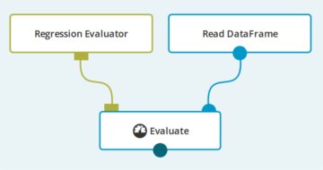

The `Evaluate` operation is used to calculate a metric value from a given
[DataFrame](../classes/dataframe.html) and an [Evaluator](../classes/evaluator.html).

**Usage example**:
{: .img-responsive .spacer .centered-image }

**Since**: Seahorse 1.0.0

## Input

<table>
<thead>
<tr>
<th style="width:15%">Port</th>
<th style="width:15%">Type Qualifier</th>
<th style="width:70%">Description</th>
</tr>
</thead>
<tbody>
<tr>
<td><code>0</code></td>
<td><code><a href="../classes/evaluator.html">Evaluator</a></code></td>
<td>The <code>Evaluator</code> that represents the evaluation algorithm.</td></tr>
<tr>
<td><code>1</code></td>
<td><code><a href="../classes/dataframe.html">DataFrame</a></code></td>
<td>The input <code>DataFrame</code>.</td>
</tr>
</tbody>
</table>

## Output

<table>
<thead>
<tr>
<th style="width:15%">Port</th>
<th style="width:15%">Type Qualifier</th>
<th style="width:70%">Description</th>
</tr>
</thead>
<tbody>
<tr>
<td><code>0</code></td>
<td><code><a href="../classes/metric_value.html">MetricValue</a></code></td>
<td>The metric value calculated for the input <code>DataFrame</code>.</td>
</tr>
</tbody>
</table>

## Parameters

<table class="table">
<thead>
<tr>
  <th style="width:20%">Name</th>
  <th style="width:25%">Type</th>
  <th style="width:55%">Description</th>
</tr>
</thead>
<tbody>

<tr>
<td><code>report type</code></td>
<td><code><a href="../parameter_types.html#report-type">ReportType</a></code></td>
<td>Type of content for generated reports.</td>
</tr>

</tbody>
</table>