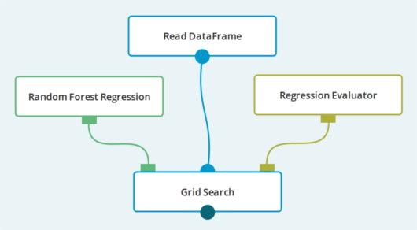

The `Grid Search` is a powerful way to optimize the process of fitting
[Estimators](../classes/estimator.html).
Parameters that describe how the learning process should be performed are vital
to the quality of the resulting model. Unfortunately, it's often difficult to guess
what the best values for them are.

The `Grid Search` operation allows us to specify a set of values for the parameters of the input
`Estimator`. The operation then goes through every combination of parameters from specified sets
and for each one the `Estimator` is fitted and the resulting trained model is evaluated
by means of cross validation.

The goal of `Grid Search` is to choose the best combination of parameters, where "best"
is defined as having received the highest grade from the [Evaluator](../classes/evaluator.html).

In order to grade a particular combination of parameters, the `Estimator` is fitted
`number of folds` times. In each "round" of training, the input dataset is divided
into training and test parts. The model fitted on the training data is used to score
the test part of the dataset. This score is evaluated and the final grade of the
parameter combination is the average score from all folds.

The result of the `Grid Search` operation is a [Report](../classes/report.html) in which
every combination of parameters is graded by the `Evaluator`.

Parameters of the `Grid Search` operation mirror the parameters of its input `Estimator`, but some
of them accept multiple, comma-separated values. These special parameters are marked with
, as in the following example:

Note that the `Grid Search` is an expensive operation. Selecting 5 values for 5 parameters results
in 25 models being cross validated.

**Since**: Seahorse 1.0.0

### Example
In the following case, the `Grid Search` operation is used to determine the best parameters
for training a [Random Forest Regression](random_forest_regression.html) model.

`number of folds` has to be at least `2`, but higher values make model evaluation more accurate.

In the **PARAMETERS OF INPUT ESTIMATOR** section of `Grid Search`'s parameters, we specify the parameter values.

Let's set `max depth` to `10, 20, 30`, `max bins` to `32, 40, 50` and `num trees` to `10, 50, 100`.
This yields 27 distinct combinations of parameters.

In the report below, every parameter combination is listed along with its grade.

## Input

<table>
  <thead>
    <tr>
      <th style="width:20%">Port</th>
      <th style="width:25%">Type Qualifier</th>
      <th style="width:55%">Description</th>
    </tr>
  </thead>
  <tbody>
    <tr>
      <td>
        <code>0</code>
      </td>
      <td>
        <code>
          <a href="../classes/estimator.html">Estimator</a>
        </code>
      </td>
      <td>The <code>Estimator</code> to be fitted and evaluated.</td>
    </tr>
    <tr>
      <td>
        <code>1</code>
      </td>
      <td>
        <code>
          <a href="../classes/dataframe.html">DataFrame</a>
        </code>
      </td>
      <td>The <code>DataFrame</code> on which the estimator will be fitted and evaluated.</td>
    </tr>
    <tr>
      <td>
        <code>2</code>
      </td>
      <td>
        <code>
          <a href="../classes/evaluator.html">Evaluator</a>
        </code>
      </td>
      <td>The <code>Evaluator</code> that evaluates the fitted model.</td>
    </tr>
  </tbody>
</table>

## Output

<table>
  <thead>
    <tr>
      <th style="width:20%">Port</th>
      <th style="width:25%">Type Qualifier</th>
      <th style="width:55%">Description</th>
    </tr>
  </thead>
  <tbody>
    <tr>
      <td>
        <code>0</code>
      </td>
      <td>
        <code>
          <a href="../classes/report.html">Report</a>
        </code>
      </td>
      <td>A <code>Report</code> about the search. Contains a score for every set of parameters that the search went through.</td>
    </tr>
  </tbody>
</table>

## Parameters

<table class="table">
<thead>
<tr>
<th style="width:20%">Name</th>
<th style="width:25%">Type</th>
<th style="width:55%">Description</th>
</tr>
</thead>
<tbody>

<tr>
<td>
<code>number of folds</code>
</td>
<td>
<code><a href="../parameter_types.html#numeric">Numeric</a></code>
</td>
<td>
A property of <code>Grid Search</code>'s internal cross validator.
Describes how many times the input dataset should be partitioned into training and test datasets.
</td>
</tr>

<tr>
<td><code>report type</code></td>
<td><code><a href="../parameter_types.html#report-type">ReportType</a></code></td>
<td>Type of content for generated reports.</td>
</tr>

</tbody>
</table>
