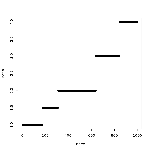

The `R Notebook` operation combines the capabilities of the
<a target="_blank" href="{{ site.SPARK_DOCS }}/api/R/">SparkR</a> shell with
the rich selection of features the <a target="_blank" href="https://jupyter.org/">Jupyter
notebook</a> offers. It provides users with a unique environment to explore their data sets.

`R Notebooks` allow the user to analyze their data by operating directly on the input `DataFrame`
by means of Apache Spark R API. The results of R code execution are presented immediately
and retained across user's sessions. Due to their versatility, `R Notebooks` serve both as a way to
get familiarized with the data and as a record of completed research.

In order to use the `R Notebook`, the user has to drag and drop the operation onto the canvas and
connect a [DataFrame](../classes/dataframe.html) to its input port. The connected `DataFrame` can
be accessed from within the `R Notebook` by calling the `dataframe()` function.

The user can start editing the code by clicking **Open notebook** in the `R Notebook` operation's
parameters panel.



**Since**: Seahorse 1.3.0

#### Examples


head(dataframe())


    city	beds	baths	sq_ft	price
    CityA 	2 	1 	820 	449178
    CityC 	2 	1 	656 	267975
    CityA 	2 	1 	636 	348946
    CityA 	2 	1 	736 	356438
    CityC 	3 	2 	1139 	473705
    CityC 	2 	2 	1074 	458227


rdf = collect(dataframe())
bed.vector <- t(rdf[, 2])
bath.vector <- t(rdf[, 3])
ratio <- sort(bed.vector / bath.vector)
plot(1:length(ratio), ratio, xlab="index", ylab="ratio")


## Input

<table>
<thead>
<tr>
<th style="width:15%">Port</th>
<th style="width:15%">Type Qualifier</th>
<th style="width:70%">Description</th>
</tr>
</thead>
<tbody>
<tr>
<td><code>0</code></td>
<td><code><a href="../classes/dataframe.html">DataFrame</a></code></td>
<td>The input <code>DataFrame</code> that can be accessed by calling <code>dataframe()</code>.</td>
</tr>
</tbody>
</table>

## Output

The `R Notebook` operation does not produce any output.

## Parameters

<table class="table">
  <thead>
    <tr>
      <th style="width:20%">Name</th>
      <th style="width:25%">Type</th>
      <th style="width:55%">Description</th>
    </tr>
  </thead>
  <tbody>
    <tr>
      <td>
        <code>execute notebook</code>
      </td>
      <td>
        <code><a href="../parameter_types.html#boolean">Boolean</a></code>
      </td>
      <td>
        If <code>true</code> then notebook code will be run on notebook
        node execution. In batch mode notebook will never be executed,
        no matter what parameter value will be.
      </td>
    </tr>

    <tr>
      <td>
        <code>send e-mail report</code>
      </td>
      <td>
        <code><a href="../parameter_types.html#boolean">Boolean</a></code>
      </td>
      <td>Appears only if <code>execute notebook = true</code>.
        If <code>true</code> then notebook result will be sent via e-mail.
        Field with e-mail address must be filled.
      </td>
    </tr>

    <tr>
      <td>
        <code>e-mail address</code>
      </td>
      <td>
        <code><a href="../parameter_types.html#string">String</a></code>
      </td>
      <td> Appears only if <code>send e-mail report = true</code>.
      E-mail address where html with notebook execution result
      should be sent to.
      </td>
    </tr>

  </tbody>
</table>
